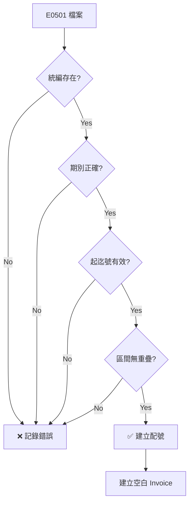
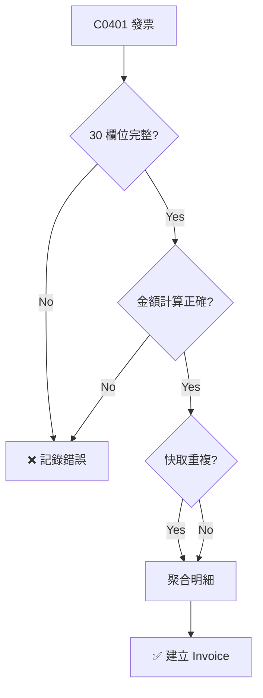
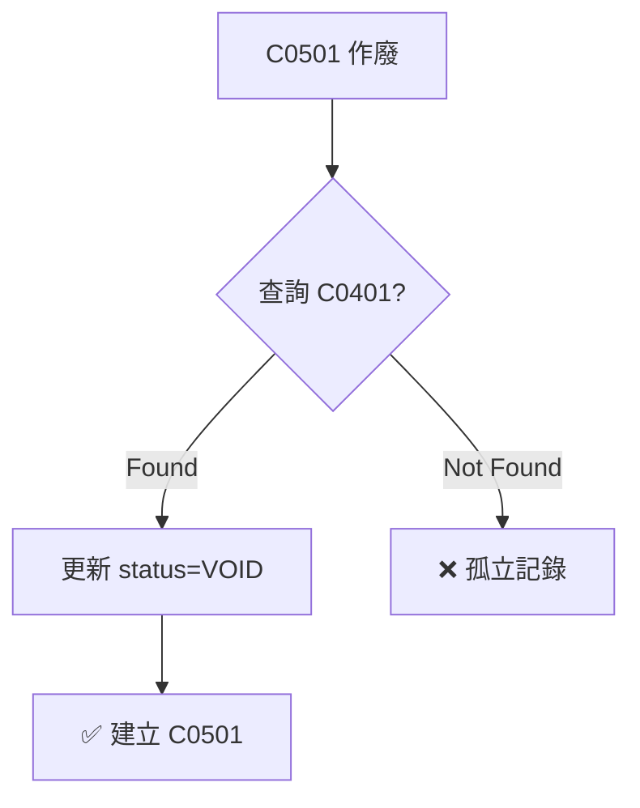

# 業務流程 - 快速參考指南

## 📌 核心流程一覽表

### E0501 配號檔匯入 (5 分鐘掌握)

| 階段 | 動作 | 驗證項 | 結果 |
|------|------|--------|------|
| 上傳 | 客戶上傳 CSV | 編碼(BIG5/UTF-8)、逗號分隔 | ✓ 檔案儲存 |
| 驗收 | MD5 校驗 | 上傳時計算值 vs 客戶提供值 | ✓ 無損傳輸 |
| 讀取 | 拆解檔案 | 移除 Header、分隔欄位 | ✓ 取得 7 個欄位 |
| 逐筆 | 驗證統編 | 8 碼、Customer 中存在 | ✓ 對應客戶 |
| | 驗證類別 | 07 或 08 | ✓ 發票類別 |
| | 驗證期別 | yyyy/mm~yyyy/mm → 5 碼 | ✓ 期別正確 |
| | 驗證字軌 | 2 位英文大寫 | ✓ 字軌正確 |
| | 驗證起號 | 8 碼、末 2 碼 00 或 50 | ✓ 起號正確 |
| | 驗證迄號 | 8 碼、末 2 碼 49 或 99 | ✓ 迄號正確 |
| | 驗證區間 | (迄-起+1) ÷ 50 整除、無重疊 | ✓ 區間有效 |
| 建立 | 寫入資料庫 | - | ✓ InvoiceAssignNo + 空白 Invoice |
| 完成 | 通知客戶端 | - | ✓ 客戶端同步更新 |

### Invoice 發票資料匯入 (5 分鐘掌握)

| 階段 | 動作 | 驗證項 | 結果 |
|------|------|--------|------|
| 上傳 | 客戶上傳 CSV | 編碼(UTF-8)、管線分隔 | ✓ 檔案儲存 |
| 驗收 | MD5 校驗 | 上傳時計算值 vs 客戶提供值 | ✓ 無損傳輸 |
| 讀取 | 拆解檔案 | 無 Header、分隔欄位(30 個) | ✓ 取得 30 個欄位 |
| 分類 | MessageType 判定 | C0401/A0401/C0501/C0701 等 | ✓ 確定處理邏輯 |
| C0401 | 開立發票 | 30 個欄位全驗證 | ✓ 建立 Invoice |
| | | 金額計算驗證 | ✓ 建立 InvoiceItem[] |
| | | 多明細聚合 | ✓ 自動加總金額 |
| C0501 | 作廢發票 | 查詢原 C0401 | ✓ 更新 status=VOID |
| C0701 | 折讓/退貨 | 查詢原 C0401 | ✓ 建立負金額折讓 |
| 建立 | 寫入資料庫 | - | ✓ Invoice + Item + History |
| XML | 生成 Turnkey XML | - | ✓ 準備上傳財政部 |
| 完成 | 通知客戶端 | - | ✓ 客戶端同步更新 |

---

## 🎯 關鍵決策點

### E0501 關鍵判定



### Invoice C0401 關鍵判定



### Invoice C0501 關鍵判定



---

## 📊 業務流程時序圖

### E0501 匯入時序

```
客戶端                Gateway              資料庫           Turnkey
   |                    |                   |               |
   |-- 上傳 E0501 ------>|                   |               |
   |                    |-- 驗證格式 ----->  |               |
   |                    |-- 驗證欄位 ----->  |               |
   |                    |-- 建立配號 ----->  |               |
   |                    |-- 建立空發票 --->  |               |
   |                    |                   |               |
   |<-- 返回成功 --------|                   |               |
   |                    |-- 通知客戶端 ---   |               |
   |-- 同步更新 ------->|                   |               |
   |                    |-- 備份資料 ----->  |               |
   |                    |-- 生成 Turnkey ---|-- 上傳 XML --->|
   |                    |                   |               |
   |                    |                   |<-- 驗收回覆 --|
   |                    |                   |               |
```

### Invoice 匯入時序

```
客戶端                Gateway              資料庫           Turnkey
   |                    |                   |               |
   |-- 上傳 Invoice ---|                    |               |
   |                    |-- 驗證格式 ----->  |               |
   |                    |-- 驗證欄位 ----->  |               |
   |                    |                   |               |
   |-- (分類處理) ---   |                   |               |
   |   ├─ C0401 開立    |-- 建立發票 ----->  |               |
   |   ├─ C0501 作廢    |-- 更新狀態 ----->  |               |
   |   └─ C0701 折讓    |                   |               |
   |                    |-- 建立明細 ----->  |               |
   |                    |-- 建立歷史 ----->  |               |
   |                    |                   |               |
   |<-- 返回成功 --------|                   |               |
   |                    |-- 生成 XML ----   |               |
   |                    |-- 上傳 Turnkey --|--> 上傳 ----->|
   |                    |                   |               |
   |                    |-- 通知客戶端 ---   |               |
   |-- 同步更新 ------->|                   |               |
   |                    |-- 備份資料 ----->  |               |
```

---

## 🔍 驗證規則速查表

### E0501 欄位驗證速查

| 欄位 | 長度 | 格式 | 例子 |
|------|------|------|------|
| 統編 | 8 | 純數字 | 12345678 |
| 類別 | 1-2 | 07\|08 | 07 |
| 期別 | 5 | 99MM (末尾雙月) | 11102 |
| 字軌 | 2 | [A-Z]{2} | AB |
| 起號 | 8 | [0-9]{8} 末尾00\|50 | 00883662 |
| 迄號 | 8 | [0-9]{8} 末尾49\|99 | 00884111 |

### Invoice 30 欄位快速定位

```
[0]  messageType      ← MessageType (C0401/A0401/C0501/C0701)
[1]  invoiceNumber    ← 發票號碼 (AB12345678)
[2]  invoiceDate      ← 發票日期 (20250113)
[3]  invoiceTime      ← 發票時間 (12:00:01)

[4]  sellerIdentifier ← 賣方統編 (12345678)
[5]  sellerName       ← 賣方名稱
[6]  buyerIdentifier  ← 買方統編 (0000000000)
[7]  buyerName        ← 買方名稱

[8]  invoiceType      ← 發票類別 (07/08)
[9]  donateMark       ← 捐贈 (0/1)
[10] carrierType      ← 載具 (3J0002/CQ0001)
[11] carrierId1       ← 載具顯碼
[12] carrierId2       ← 載具隱碼
[13] printMark        ← 列印 (Y/N)
[14] npoban           ← 捐贈代號
[15] randomNumber     ← 防偽碼 ([0-9A]{4})

[16] description      ← 品名
[17] quantity         ← 數量
[18] unitPrice        ← 單價
[19] amount           ← 金額 (qty × price)
[20] sequenceNumber   ← 明細序號

[21] salesAmount      ← 應稅銷售額
[22] freeTaxSalesAmount  ← 免稅銷售額
[23] zeroTaxSalesAmount  ← 零稅率銷售額
[24] taxType          ← 課稅別 (1/2)
[25] taxRate          ← 稅率 (0.05)
[26] taxAmount        ← 稅額 (amt × rate)
[27] totalAmount      ← 總計 (sales × (1+rate) - disc)
[28] discountAmount   ← 折扣
[29] cardLast4No      ← 卡末四碼
```

---

## ⚡ 常見錯誤快速排查

### E0501 常見錯誤

| 錯誤 | 原因 | 解決 |
|------|------|------|
| 統編不存在 | Customer 未建檔 | 先建檔 Customer |
| 期別格式錯誤 | 不是 5 碼或末尾非雙月 | 確認為 11102/11104 格式 |
| 字軌格式錯誤 | 非大寫英文 | 改為大寫 (AB 不是 ab) |
| 區間重疊 | 與既有配號區間重疊 | 避開已使用區間 |
| 起迄號末尾錯誤 | 起號末尾非 00/50 或迄號非 49/99 | 重新計算區間 |

### Invoice 常見錯誤

| 錯誤 | 原因 | 解決 |
|------|------|------|
| 金額計算錯誤 | totalAmount ≠ sales×(1+rate) | 重算金額 |
| 發票號不在配號範圍 | E0501 未匯入或號碼超出範圍 | 先匯 E0501 |
| 載具格式錯誤 | 3J0002 應為 /ABC1234 | 加上 / 符號 |
| 隨機碼錯誤 | [0-9A]{4} 包含 B-Z | 只用 0-9 和 A |
| 捐贈未設定 | donateMark=1 但 npoban 未填 | 填入捐贈代號 |
| 編碼錯誤 | 非 UTF-8 或含 BOM | 重新編碼為 UTF-8 |

---

## 📈 效能與特徵

### 非同步處理
```java
@Async
processE0501Async(ImportFileDTO);  // 背景執行，不阻塞
processInvoiceAsync(ImportFileDTO); // 大檔案適用
```

### 交易隔離
```java
updateWithNewTransaction()  // REQUIRES_NEW，獨立交易
// 單一行的失敗不影響其他行
```

### 快取機制
```
C0401 快取 → 供 C0501 查詢原發票
         → 供 C0701 折讓查詢
         → 支援多明細聚合
```

### 詳細日誌
```
IMPORT_FILE_LOG
├─ LINE_NO: 精確行號
├─ LOG_TYPE: INFO/WARNING/ERROR
├─ MESSAGE: 詳細訊息
└─ LOG_TIME: 時間戳
```

---

## 🔗 相關資源

| 文件 | 位置 | 用途 |
|------|------|------|
| **業務流程** | `BUSINESS_FLOW.md` | 本文檔 (完整流程圖) |
| **E0501 範本** | `templates/E0501_template.md` | 配號檔格式與驗證規則 |
| **Invoice 範本** | `templates/Invoice_template.md` | 發票資料格式與驗證規則 |
| **匯入規範** | `import-spec.md` | 技術規範與 API 說明 |
| **範本說明** | `templates/README.md` | 所有範本的文件索引 |

---

## 💡 業務提示

### ✅ 最佳實踐

1. **先驗後傳**：上傳前自行驗證欄位格式
2. **分批匯入**：大量資料分多次上傳，便於排查
3. **保留回饋**：每次收到回饋檔，記錄驗收結果
4. **定期檢查**：監控 IMPORT_FILE_LOG 日誌
5. **客戶端同步**：收到推通知後主動拉取更新

### ⚠️ 常見陷阱

1. **編碼混亂**：E0501 用 BIG5、Invoice 用 UTF-8
2. **分隔符混淆**：E0501 用逗號、Invoice 用管線符
3. **金額不符**：未正確計算稅額或折扣
4. **迴圈依賴**：C0501 未找到對應 C0401
5. **格式不一致**：日期/時間格式不標準

---

## 🎯 快速開始

### 第一次使用？按順序

1. 讀 `templates/E0501_template.md` 瞭解配號檔格式
2. 讀 `templates/Invoice_template.md` 瞭解發票資料格式
3. 準備測試 CSV 檔案（1-3 筆記錄）
4. 通過 UI 或 API 上傳測試
5. 查看 IMPORT_FILE_LOG 驗證結果

### 遇到問題？按順序

1. 查「常見錯誤快速排查表」
2. 檢查 IMPORT_FILE_LOG 日誌訊息
3. 驗證欄位值是否符合格式要求
4. 對比範本檔案的正確範例
5. 聯繫技術支援並提供日誌

---

**快速參考版本**：1.0  
**簡化程度**：快速查詢  
**完整版本**：詳見 `BUSINESS_FLOW.md`
