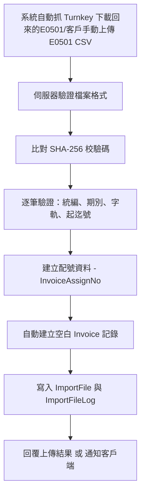
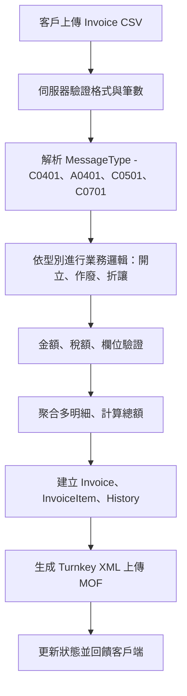

# 電子發票 Turnkey 系統需求訪談初稿 (Interview Draft)

> 文件版本：v0.3（依業主調整版重新整合）  
> 文件用途：用於需求訪談與需求歸納，後續將轉為正式《系統功能規格書（SRS）》與 TDD / BDD 測試案例。

---

## 1️⃣ 專案背景與目標

本專案旨在重構舊有的「電子發票匯入與轉拋系統」，以符合財政部 **MIG 4.1** 標準，並整合主機端、客戶端及 Turnkey 平台的資料流，達成以下目標：

- 提供業者上傳電子發票 CSV（E0501／Invoice）之管道。
- 驗證、轉換、生成 Turnkey XML 並安全上傳財政部電子發票平台。
- 解析財政部回饋訊息，回拋結果給客戶端。
- 支援加值中心角色，提供多公司代理上傳服務。
- 符合稅法、營業稅法及電子發票實施作業要點。

### 🎯 系統主要任務
- 匯入與驗證：處理 E0501（發票號段）及 Invoice（發票明細）。
- 轉檔：依據 MIG 4.1 格式生成 XML，並完成簽章與上傳。
- 通知與回饋：接收 MOF 平台回覆，更新狀態並通知客戶端。
- 監控與紀錄：顯示 TURNKEY 訊息、上傳歷程、錯誤記錄與執行 Log。

> 補充：專案目標是否包含行動端 App 或 API 給外部客戶使用？

回覆（可直接納入需求）：

- API：系統應提供 RESTful API（OAuth2 / JWT 驗證）供外部客戶或第三方系統上傳 E0501/Invoice、查詢上傳結果與接收回饋。API 優先建置，並提供範例 SDK（Java / Node.js）以利客戶整合。
- 行動端 App：若業務上需要針對非 IT 客戶提供簡單上傳介面（例如分店、外勤或代收點），可另外開發輕量行動 App（或 PWA），但建議初期以 API + Web 前端（響應式）先行支援，再視使用率評估獨立 App 的必要性。

設計要點與驗收建議：

- API
  - 認證：OAuth2 (Client Credentials) 與 JWT，支援 API Key 作為輔助機制
  - 權限：RBAC（上傳、查詢、管理）與多公司授權範圍（tenant scoping）
  - 速率限制（Rate Limit）與日流量配額（quota）管理
  - 回傳格式：同步接受上傳後回傳上傳紀錄 ID。非同步處理結果以 Webhook 為主，並提供 WebSocket 作為 UI 即時更新；不以客戶端輪詢作為推播機制。
  - 文件：OpenAPI (Swagger) + 範例請求/回應

- 行動 App
  - 先做 PWA/響應式前端，覆蓋大多數需求
  - 若要做 native app，需明確列出行動端差異化功能（掃描、離線緩存、通知）

待業主確認事項：

1. 是否需在第一階段提供公開 API（讓客戶自行串接）？(是/否)
2. 是否需要 Webhook 推播（當後端處理完成時通知客戶）？(Webhook/否；備註：系統同時保留內部 spring 事件發佈訂閱 與 WebSocket/Email 做為備援)
3. 若需 App：是否要支援離線上傳並在有網路時自動重送？

已回覆（業主提供）：

1. 是否需在第一階段提供公開 API：是
2. Webhook 與 event 推播：決定以 Webhook 為主要外部推播機制（不提供輪詢），系統仍需內建 event trigger 作為擴充點；同時提供 WebSocket 與 Email 作為即時與人工通知備援。
  - 備註：已將 webhook-first 設計列為需求，包含 Webhook 的認證（例如 HMAC/TLS）、重試策略與 DLQ 機制，並在 SRS 中列出具體 acceptance criteria。
3. 行動 App：是（需支援離線上傳並在有網路時自動重送）

---

## 2️⃣ 使用者角色與權限

| 角色 | 說明 | 權限 | 典型操作 |
|------|------|------|-----------|
| 系統管理員 (Admin) | 系統維護人員 | 全權存取 | 帳號管理、錯誤追蹤、系統設定 |
| 加值中心操作員 (Agent) | 代傳營業人發票 | 客戶管理、上傳、查詢 | 上傳發票、手動分配號段 |
| 客戶端使用者 (Client) | 一般業者 | 僅管理自身資料 | 上傳 E0501 / Invoice 檔、查詢結果 |
| 維運人員 (Ops) | 系統監控與異常處理 | 可檢視 Log、重送 | TURNKEY 錯誤追蹤、重送任務 |

> 補充：是否需要新增「總公司／分公司」或「第三方上傳代理」角色？

回覆（可直接納入需求）：

- 新增「總公司／分公司」與「第三方上傳代理」角色通常能提升系統彈性與管理性，建議採用分層帳號模型：
  - 總公司 (Parent Company)：擁有管理子公司之能力（查看/設定、授權、整體報表）
  - 分公司 (Subsidiary)：僅能管理 / 上傳其自身資料與查詢結果
  - 第三方上傳代理 (Agent)：可代表多個客戶上傳，擁有代理管理介面與授權設定

設計要點：

- 多層 RBAC 與委任機制：總公司可以授權分公司或代理的存取範圍（例如僅上傳、僅查詢或可重送）
- 代理上傳需明確記錄「代理關係」與「被代理公司 ID」，並在匯入紀錄/報表中顯示原始客戶 ID 與代理者 ID
- 權限範圍/帳單：若系統要計收費用，需區分由哪一方計費（總公司或被代理公司）

資料隔離與合規性：

- 若客戶有嚴格隔離要求（例如財務資料不得混置），需支援資料隔離策略（見多租戶補充）

待業主確認事項：

1. 是否要讓總公司查看/管理所有子公司的上傳紀錄？(是/否)
2. 第三方代理是否能跨公司查看上傳結果，或僅能看到其代理之公司？
3. 計費邏輯：單一帳號計費還是依被代理公司計費？

已回覆（業主提供）：

1. 總公司是否能查看/管理子公司：是，但子公司之間不能互相查看資料
2. 第三方代理目前：暫時不支援代理機制（目前不行）
3. 計費邏輯：--（因為代理機制暫不支援，後續若啟用代理才需定義）

---

## 3️⃣ 現行作業流程摘要

### A. E0501 配號檔匯入流程



### B. Invoice 發票資料匯入流程



### C. TURNKEY 訊息處理流程

- 系統接收 MOF 平台的回饋 XML 檔（ACK / ERROR）。
- 解析回覆內容並更新對應發票狀態。
- 於「TURNKEY 訊息」頁顯示結果與錯誤碼。
- 若為失敗可重送或通知客戶端人工處理。

---

## 3️⃣.1️⃣ 業主現行作業流程（實務細節）

以下為業主（現場運作）提供之實務作業細節，已整理為可直接納入需求訪談文件的條列與小節。請於需求確認時一併簽核這些作法是否為最終作業規範。

A. 發票天條（不可違反的規則）
- 發票號碼不可重複，且每張發票只可申報一次。若某號碼已申報後發現內容有誤，需先作廢該發票後重新開立新發票。
- 財政部的卷定義：每 50 號為 1 卷（例如 00-49、50-99、100-149）；卷的起始號碼必為 x00 或 x50（起始為 00/50），結束號碼為 x49/x99，且一卷內號碼必須連號。
- 加油站的卷定義（業主例外）：加油站以 250 張為一卷（例如 0-249 為一卷），因此財政部的 5 卷 等於 加油站的 1 卷。無論卷大小，均須保持「卷內連號」的原則。

B. 前置作業（業主在啟用前需要準備的事項）
- 業主需向財政部申請成為「加值中心」。
- 在業主機房安裝 Turnkey（由財政部或授權廠商提供），並將業主之憑證匯入該 Turnkey 系統。
- 在 Turnkey 上設定發票收送排程與收送目錄（此目錄會與我們系統的 Agent / 排程互相連動）。

C. 客戶與加油站系統設定（在我們系統 turnbridge 的設定項）
- 簽約後，業主會在我們系統（turnbridge）建立客戶公司基本資料與帳號，並在財政部端設定該公司由業主代收/送發票資訊（代收授權）。
- 針對中油類客戶，需額外設定「加油島（island）」與「面（face）」。一個客戶可有多個加油島；每個加油島可有多面。面編號從 1 起（面 0 保留給手開發票使用）。
  - 每個面可以設定：是否要上傳發票、每面需準備幾卷（以 250 張/卷 為單位）。

D. 期別與排程（發票期別）
- 發票以每兩個月為一期（bi-monthly），一年共 6 期。第一期為 1、2 月；第二期為 3、4 月；以此類推。
- 系統會在偶數月的 20 號（可由排程調整）從 Turnkey 安裝時設定的固定目錄抓取下一期的 E0501（營業人電子發票配號檔）。例如在某年 10/20 抓取的是第 6 期（11、12 月）的號碼。

E. E0501 自動匯入與配號規則（要點）
- 系統收到 E0501 後會自動匯入並檢核檔案；若匯入失敗或號碼不足，需人工向財政部申請補號或手動匯入。
- 中油（CPC）客戶：依照設定的「加油島與面」自動配號（每面使用其分配的卷與號段）。若號碼不夠，系統會註記不足並發通知（不會硬性指派超出範圍），並且由 Agent 將配號／狀態寫入客戶的 3S 系統做後續處理。
- 台塑（例）客戶：系統以「全體配號」方式直接由系統統一分配（不做面/島分拆）。
- 其他客戶：採手動配號流程，需經核准後才會開始使用該號段（手動配號在 UI 上需有審核流程與 Audit Trail）。

F. 發票上傳來源與方式
- 中油場景：透過我們的 Agent 彙整 3S 系統要上傳的發票，Agent 將彙整後的檔案傳到主機端（我們系統）。
- 台塑場景：Agent 監聽特定目錄（pickup 目錄），有檔案即上傳至我們系統。
- 其他場景：Agent 或客戶可透過 API 直接上傳檔案。

G. 檔案內容、格式與轉檔

- 加油站會每日上傳 1 到多次檔案（頻率視站別與時間而定）。每個上傳檔案會混合各種訊息格式（例如 F0401、F0501、F0701 等）。
- 每個上傳檔案在舊系統限制為最多 999 筆資料（舊系統為效能考量）；新系統可評估是否放寬或提供分割上傳/批次處理方案，但仍需保留相容性選項以便平滑切換。
- 我們系統在驗證通過後，會將每張發票轉為 Turnkey 所需之 XML（不同訊息格式對應不同 XML 結構，一張發票單一 XML 檔案），並依訊息格式將檔案放到相對的上傳目錄（供安裝在機房的 Turnkey 抓取）。

**補充（業主回覆與設計決定）**

- 目前業務以批次檔案交換為主，每個檔案的「筆數」採用舊系統定義：**一張發票若有多明細，則以明細筆數計入總筆數**（例如：1 張發票 3 個明細＝3 筆）。
- 為兼顧效能與相容性，**暫定保留每檔上限為 999 筆**（若單筆發票的明細導致超過 999，則該發票需完整移至下一個檔案，不能拆開同一張發票的明細）。
- 若未來評估放寬上限，系統需具備「伺服器端自動分割」能力（由系統決定分割邊界，並產生對應的 ImportFile 記錄），或在 API 層拒收超大檔並回報客戶端分割建議。

### Backend 與 Agent 的責任範圍建議

- 根據業主回覆與可維運性的考量，建議採用「**Backend 專注於檔案交換、驗證與轉檔**，**Agent 負責在客戶端收集/整理/產生合規檔案並上傳到 Backend**」的分工：
- Agent（建議）職責：蒐集客戶端原始資料、進行本地前置檢核、將多來源資料整合為符合系統上傳規範的 CSV/ZIP（包含 SHA-256、metadata），並透過安全通道上傳至 Backend；對於沒有開發能力的客戶，可由業主提供 Agent（未來規劃）。
  - Backend（既有）職責：接收檔案、執行格式驗證、解析、產生 Turnkey XML、管理 ImportFile/ImportFileLog、與 Turnkey 目錄互動（供 Turnkey 拉取）以及回饋解析與通知。

- 優點：降低 Backend 對客戶端多樣性的處理負擔（格式/編碼、離線緩存），Agent 可實作客製化整合（POS/3S）；Backend 可專注於一致的驗證與轉檔流程。
- 風險／代價：需規劃與維護 Agent 部署與版本管理；若 Agent 未普及，部分客戶仍需透過 API 直接上傳，Backend 必須保留完整驗證與錯誤回饋機制。

- 決策建議：先以 **Backend 為檔案交換與轉檔核心**（需支援 API 上傳與 UI 手動上傳），同時把 Agent 規劃為推薦的客戶端彈性方案（Roadmap/Phase 2 實作）。

H. Turnkey 上傳與回饋整合
- 安裝於業主機房的 Turnkey 依排程讀取相對目錄並上傳發票至 MOF（或透過簽章/上傳機制處理）。
- 我們系統則監聽或由排程讀取 Turnkey 的回覆（ACK / ERROR XML），解析後整合回資料庫，並依上傳檔案產生客戶回饋檔以通知客戶端（或由 Webhook / WebSocket 推播）。

I. 例外與通知處理
- 若自動配號或匯入失敗（例如號碼不足、格式錯誤、SHA-256 錯誤），系統應註記錯誤並發出告警通知（Email / Web UI / Webhook），同時記錄 ImportFile 與 ImportFileLog 供後續人工處理。
- 若上傳後 Turnkey 回應失敗，系統應提供重送機制與人工重送入口，並將重送活動記錄於 Audit Trail 中。

J. 合規日常作業與額外需求（業主補充）
- Turnkey 回饋檔：Turnkey 每天會在回饋檔中提供前一日的上傳/處理統計（每日彙總）。本系統必須每日比對 Turnkey 回饋檔中的筆數與系統自行統計的筆數是否相同，若不一致需產生差異報告並發出告警以供人工追查。
- 每月上傳空白發票：系統需支援在每月 10 日前（deadline）將空白發票清單依 MIG 規格格式（例如 E0501 的相應 XML/CSV）傳送至財政部或透過 Turnkey 上傳；此為月度作業之一，需有排程與送達確認（receipt）紀錄。
- 手開發票 UI：系統必須提供手開發票（人工開立發票）的 UI（含發票欄位輸入、稅額計算、即時欄位驗證與預覽），並在手開發票情境下支援面 0 的發票號段管理與上傳/儲存流程，且所有手動操作需寫入 Audit Trail。
- 發票 PDF 產製：系統需產製符合財政部規定格式的發票 PDF（含格式版面、簽章欄位、QRCode 或條碼等欄位若為規定），並提供下載與列印功能。PDF 產製流程需被列入測試與驗收標準（樣式一致、欄位完整、可被財政部／客戶端接受）。

---

## 4️⃣ 現行系統痛點與改進方向

| 項目 | 現況 | 問題 | 改進建議 |
|------|------|------|-----------|
| 檔案格式驗證 | 以 Java 手動 split 方式驗證 | 格式錯誤時難以定位問題行 | 改採 schema 驗證（OpenCSV / Bean Validation） |
| 記錄錯誤 | 寫入 ImportFileLog | 缺乏對應 UI 呈現 | 增加 Web Log Viewer（可篩選 ERROR / WARNING） |
| 上傳回饋 | 僅文字回傳 | 缺乏統一 API 或即時推播 | 提供 JSON API + WebSocket 通知機制 |
| Turnkey 轉檔 | 需手動執行 | 缺乏排程與自動重送 | 導入 Scheduler / Retry 機制 |
| 安全性 | 憑證分散管理 | 更新與簽章容易出錯 | 建立憑證託管與提醒服務 |

>>> 請補充：是否要保留「手動轉檔」與「發票分配」操作介面？

建議回覆（可直接納入需求）：

- 建議保留「手動轉檔」與「發票分配」的操作介面作為運維/客服的後備手段，但主流程應優先自動化。具體做法：
  - 自動模式（預設）：系統自動處理 CSV → 生成 XML → 上傳 MOF → 解析回饋
  - 手動模式（需授權）：允許 Ops / Agent 在 UI 上查看待處理項並觸發「手動轉檔」「重送」「分配號段」等操作

設計要點：

- 操作紀錄（Audit Trail）：所有手動操作需完整記錄操作者、時間、原因與變更前後狀態
- 權限控管：僅限具備相應權限的帳號執行手動轉檔或分配號段
- 變更審核（可選）：對於敏感操作（例如變更配號或重送大量發票），可加入二階段審核流程

待業主確認事項：

1. 是否允許客服或業務人員在 UI 執行發票號段分配？是否需二階段審核？
2. 是否需要在手動操作時顯示系統建議（例如檢測到號段重疊時自動建議替代號段）？

已回覆（業主提供）：

1. 是否允許在 UI 執行發票號段分配：允許，且必須經過審核（建議二階段審核）
2. 是否需要系統建議：建議實作（在手動操作時顯示系統建議），可協助減少錯誤

---

## 5️⃣ 預期功能模組

### 模組一：上傳與驗證模組
- 上傳 E0501、Invoice 檔案（支援 BIG5、UTF-8）
- 即時檢核欄位格式、期別、統編與字軌規則
- SHA-256 驗證、錯誤行記錄、上傳結果回饋

### 模組二：轉檔與上傳模組
- 生成符合 MIG 4.1 的 XML 檔案
- 加密簽章（依財政部規範）
- 上傳至 Turnkey 平台（HTTP / SFTP）
- 接收回覆檔並解析狀態

### 模組三：資料維護與查詢
- 發票查詢（號碼、客戶、日期）
- 客戶資料維護（新增、修改）
- 系統記錄與 TURNKEY 訊息查詢

### 模組四：通知與備份
- 自動通知上傳結果（E-Mail / WebSocket）
- 備份客戶上傳與回饋檔
- 提供歷史資料下載

---

## 6️⃣ 技術與開發方向

| 項目 | 選用技術 | 備註 |
|------|------------|------|
| Backend | Spring Boot 3.x + JPA (PostgreSQL) | 使用 **JHipster v8.11.0** 產生骨架，可重用舊邏輯（UploadCsvFileService） |
| Frontend | React (由 jHipster v8.11.0 產生) + Tailwind/Bootstrap | 我們將使用 jHipster v8.11.0 產生之前端骨架（位於 `src/main/webapp`），在該基礎上實作功能；舊系統的 Thymeleaf 為參考或過渡使用 |
| Storage | PostgreSQL + FileSystem + Redis | 匯入紀錄、Log、配號資料；Redis 用於快取與分散鎖（非初期事件總線） |
| API | RESTful (/api/upload/e0501, /api/upload/invoice) | 可供 App 或客戶端自動化上傳 |
| Schedule | Spring Scheduler / Quartz | 處理批次轉檔與重送 |
| Security | Spring Security + 憑證管理 | 整合 MOF 憑證與憑證更新提醒 |
| Realtime | WebSocket | 用於即時通知、上傳狀態同步 |

### 6.1 事件驅動與消息總線（更新）

- 初期採用 Spring Boot 內建的事件機制（ApplicationEvent / @EventListener）作為內部事件驅動（模組解耦、同一進程或同一 instance 的事件分發）。
- 不在第一階段接入 Kafka / RabbitMQ / Redis Stream 作為外部消息總線；若未來需要處理跨實例的高吞吐事件，可評估用 Kafka 或 Redis Stream 做升級。
- Redis 仍保留為快取、分散鎖與短期 counters（Rate limiting、重試計數器），但不作為主要的跨進程事件總線，除非後期決議改用 Redis Streams。

（已依您回覆：目前僅做 Spring 內建事件驅動，未外接 Kafka / RabbitMQ）

>>> 請補充：是否要加入 Redis 快取與多租戶（multi-tenant）機制？

建議回覆（可直接納入需求）：

- Redis：建議採用 Redis 作為快取層與分散鎖（distributed lock）機制，使用場景包括：
  - 緩存靜態參數（驗證規則、字軌配置）以降低 DB 負載
  - Webhook / 工作佇列的短期緩存（處理中狀態）
  - Rate limiting（API 節流）與短期重試計數器
  - 分散鎖：配號（InvoiceAssignNo）自動分配時避免競爭條件

- 多租戶（Multi-tenant）：是否採用多租戶取決於業務與合規需求，常見選項：
  - Shared schema (同一 DB table，tenant_id 欄位) — 成本最低，管理較便捷
  - Schema per tenant (同一 DB，不同 schema) — 中等隔離度，較易備份/恢復
  - Database per tenant (每 tenant 獨立 DB) — 最佳隔離（合規/資安），但成本最高

建議採用：
  - 若客戶數量中等且多為中小企業（無嚴格隔離需求）→ 採用 Shared schema + tenant_id；再以 Row Level Security（RLS）或應用層面加強隔離
  - 若有大型企業或代收中心需嚴格隔離（需符合法人合規）→ 提供 Schema-per-tenant 或 Database-per-tenant 選項（作為 premium 功能）

待業主確認事項（關鍵）：

1. 估計系統將支援的租戶數（公司數或年上線公司量）？
2. 是否有合規或客戶要求必須物理隔離（DB per tenant）？
3. 預期 API QPS（每秒請求數）與每日上傳量（CSV 筆數/天）為何？（用於決定快取與水平擴展需求）

已回覆（業主提供）：

1. 估計租戶數：500 家客戶（預估租戶／公司數）
2. 物理隔離需求：目前無特別要求（採用 Shared schema + tenant_id）
3. 預期流量與儲存：每期（2 個月）6,000,000 張為預估值；客戶群體為加油站類客戶
   - 加油站容量模型：單一加油站 = 6 個槍 × 8 台車/小時 × 4 個加油島 × 24 小時 = 46,080 張／日
   - 平均每日上傳量（全系統）：6,000,000 ÷ 60 天 ≈ **100,000 張／日**
   - 平均每家公司（500 家）：100,000 ÷ 500 ≈ 200 張／日（遠低於加油站單日峰值）
   - 儲存需求：1 年熱資料保留；其他資料視為冷資料

容量補充資訊（業主已確認）：

✅ **客戶構成**：
- 目前客戶群體全為加油站（~120 家，正成長中）
- 預估目標為 500 家，但非全部加油站，會逐步加入零售商
- 加油站規模分布：最小 2 個加油島；最大未定（預估可達 4-6+ 個加油島）
- 業績基準：以競爭對手「綠界」為參考，他們 1 期最少 6,000 張發票的標準

⚠️ **尖峰時段與成長預期**（需內部評估，下述為產業標準估值）：

- **尖峰因子**：根據加油站業界經驗，上下班尖峰時段（AM 7-9、PM 5-7）為日均流量的 **3-5 倍**，建議以 **4 倍** 做為設計目標
  - 日均：100,000 張 → 尖峰時段（每 2 小時）：40,000-50,000 張
  - 尖峰小時 QPS：約 11-14 req/s（需應對突發流量）

- **成長預期**（建議情景）：
  - 保守案例（3 年）：120 家 → 250 家（+108%）；發票量保持穩定或微增
  - 中度成長（3 年）：120 家 → 350 家（+192%）；加入零售商後發票量 +30%
  - 積極成長（3 年）：120 家 → 500 家（+317%）；零售商高活躍度，發票量 +50-80%
  - 建議以「中度成長」為容量規劃基準，預留 50% 成長裕度

其他補充建議：

- 若採用 Shared schema，建議同時導入 Redis 作為突發流量緩衝，以及使用分散鎖避免配號 race condition。
- 若預期高併發，請同時考慮水平擴展（多實例）、資料分區（partitioning）與後端批次處理（Worker pool）。

---

已在本文中標示多處「待業主確認事項」，請根據上面列出的 7 個關鍵問題回覆或選擇（簡短答案即可），我會依你的回覆把草案整理成正式 SRS 條目並補齊缺漏。

---

## 7️⃣ 開發與測試策略

### ✅ TDD（Test-Driven Development）
- 針對 Service 層撰寫 JUnit 測試，例如：
  - `E0501ValidatorTest`：驗證統編、期別、字軌。
  - `InvoiceCheckerTest`：驗證 MessageType、金額計算、稅額邏輯。
  - `TurnkeyXmlGeneratorTest`：生成 XML 是否符合 MIG Schema。

### ✅ BDD（Behavior-Driven Development）
- 使用 Cucumber 撰寫 Feature：
  ```gherkin
  Feature: E0501 上傳與驗證
    Scenario: 上傳合法配號檔
      Given 客戶上傳 e0501_12345678_20250113.csv
      When 系統完成驗證與匯入
      Then 產生配號記錄並回覆成功
  ```
- 以業務語言撰寫驗收測試，並映射至 Spring Boot 測試程式。

### ✅ E2E 測試（End-to-End）
- 以 Cypress 驗證前端操作流程：登入 → 上傳 → 查詢 → 補印。

---

## 8️⃣ 開放訪談項目（請業主補充）

- [ ] 系統是否需支援 **自動回饋解析**（即時 vs 批次）？
- [ ] 是否要支援 **多公司多平台 Turnkey 上傳排程**？
- [ ] 憑證與加密模組由誰維護（系統或業者自行）？
- [ ] 舊系統資料是否需匯入？
- [ ] 是否要開發 **客戶端小型 App（Agent）** 協助非 IT 用戶上傳？

---

> 📄 待確認後，將依此文件產出：
> - 《電子發票 Turnkey 系統功能規格書（SRS）》
> - 《TDD 單元測試案例設計文件》
> - 《BDD 行為測試 Feature 檔案集》

---

（文件完）
