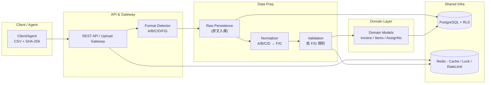
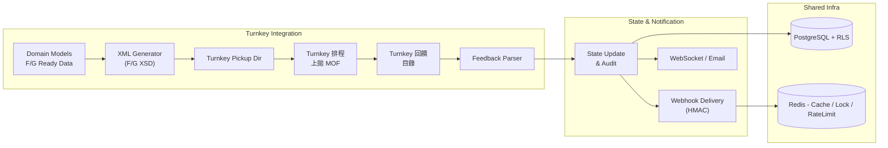

# 電子發票 Turnkey 系統功能規格書（SRS）

> **文件版本**：v1.0（最終稿｜套用 MIG 4.0 併版：A/B/C/D → F/G，對外唯一輸出 F/G）
> **日期**：2025-11-12
> **依據**：`turnkey_system_interview_draft_v0.3`、`DECISION_LOG_v0.3`、`CAPACITY_AND_ARCHITECTURE.md`、`webhook_spec.md`、`turnkey_review_findings_v0.1`、`mig4.0-changelog.md`
> **用途**：定義電子發票 Turnkey 系統之功能、介面、流程、資料、安全與驗收標準
> **簽核者**：業主、系統架構師、技術主管、專案經理

---

## 1️⃣ 專案總覽

### 1.1 目標
重構現有「電子發票匯入與轉拋系統」，完全符合 **MIG 4.1**，並依 **MIG 4.0 併版**將舊訊息（A/B/C/D 系）標準化為 **F/G 系**。以 **API + Webhook** 為核心，支援批次與即時整合，對應加值中心營運（多租戶、總分公司層級）。

### 1.2 範圍
* 接收與驗證：**E0501 配號檔**、**Invoice 明細檔**（可能混含 A/B/C/D 舊訊息與 F/G 新訊息）。
* 轉檔：**一律以 F/G 系列**產生 XML、簽章、置 Turnkey 目錄、由 Turnkey 排程上拋 MOF。
* 回饋：解析 ACK/ERROR，更新狀態並透過 Webhook 推播。
* 維運：手動轉檔/手動配號（**二階段審核**）、監控、報表、稽核。
* 多租戶：Shared schema + RLS；總公司可見子公司；系統管理者可見全部。

### 1.3 文件結構與維護

| 類型 | 目錄 / 代表文件 | 說明與責任 |
| --- | --- | --- |
| 決策與訪談 | `docs/requirements/` → `DECISION_LOG_v0.3.md`、`turnkey_system_interview_draft_v0.3.md`、`webhook_spec.md` | 決策、容量、Webhook 契約；PO/SA 維護 |
| 系統規格 | `docs/spec/` → 本 SRS、`openapi-turnbridge-v1.yml`、`turnbridge-rfp-v1.0.md`、`mig-message-type-mapping.md` | 功能/介面/訊息定義；架構師與技術主管同步 |
| 整合指南 | `docs/integration/` → `README.md`、`turnkey-webhook.md`、`turnkey-flow.yaml`、`turnkey-flow.md`、`webhook-contract.md`、`test-scripts.md`、`scripts/newman-smoke.sh`、`e2e-scenarios.md`｜`docs/turnkey/` 保留官方 PDF | 整合工程師維護；搬遷依 DEC-012 追蹤 |
| 運維流程 | `docs/operations/` → `README.md`、`monitoring.md`、`incident-playbook.md`、`manual-resend.md`、`turnkey-healthcheck.md` | SRE/Ops 維護；與 §5 人工流程對應 |
| 舊制參考 | `docs/legacy-system-docs/` → `舊系統_import-spec.md`、`舊系統_E0501_template.md`、`舊系統_Invoice_template.md` 等 | 僅供轉換參考，不得再更新流程 |

> `docs/README.md` 提供快捷導覽並標註責任人；任何程式或流程變更需檢查對應文件是否同步（搭配 `AGENTS.md §13`）。

---

## 2️⃣ 系統架構與容量

### 2.1 概念架構（Mermaid）
下圖將整體流程拆為「Upload + Normalize」與「Turnkey + Feedback」兩個層面，方便對應責任分工與擴充點。

#### 2.1.1 Upload + Normalize


#### 2.1.2 Turnkey + Feedback


### 2.2 技術棧

| 層級   | 技術                                          | 備註                          |
| ---- | ------------------------------------------- | --------------------------- |
| 前端   | React（JHipster 8.11 骨架）+ Bootstrap/Tailwind | PWA 可行                      |
| 後端   | Spring Boot 3.4 / JPA / Spring Security     | 架構核心                        |
| DB   | PostgreSQL 14+（**RLS**）                     | Shared schema + `tenant_id` |
| 快取/鎖 | Redis（Sentinel）                             | Cache、分散鎖、Rate Limit        |
| 批次   | Spring Scheduler / Quartz                   | 轉檔、回饋、日報                    |
| 通知   | Webhook（HMAC）、WebSocket、Email               | Webhook-first               |
| 檔案   | 檔案系統/NAS（或 S3 介面）                           | 匯入與回饋存檔                     |

### 2.3 容量與目標（修正後）

| 指標        | 目標值              | 備註                 |
| --------- | ---------------- | ------------------ |
| **日均發票量** | **100,000 張/日**  | 以目前預估修正            |
| 尖峰流量      | ~4× 日均           | 早晚尖峰；估 11–14 req/s |
| 单檔限制（上傳）  | 999 筆（以**明細行**計） | **整張發票不可跨檔拆分**     |
| 熱資料保留     | 1 年              | 冷資料歸檔              |
| 租戶數       | ~500             | 加油站為主，預留零售成長       |

---

## 3️⃣ MIG 4.0 變更套用：訊息家族整併（**關鍵規則**）

### 3.1 官方變更摘要（納入系統規格）

```
存證類發票整併
刪除 A0401、C0401，新增 F0401 平台存證開立發票（整併 A0401 及 C0401）
刪除 A0501、C0501，新增 F0501 平台存證作廢發票（整併 A0501 及 C0501）
刪除 A0601
刪除 C0701，新增 F0701 平台存證註銷發票
刪除 B0401、D0401，新增 G0401 平台存證開立(傳送)折讓證明單（整併 B0401 及 D0401）
刪除 B0501、D0501，新增 G0501 作廢折讓證明單
```

### 3.2 系統採用原則

1. **輸出唯一性**：對 Turnkey 的 **所有輸出**一律為 **F/G 系列**（F0401/F0501/F0701、G0401/G0501）。
2. **輸入相容**：若客戶仍上傳 **A/B/C/D 系**，系統：

   * （a）**原文保存**：逐行原始內容、原訊息別（A/B/C/D/F/G）入庫；
   * （b）**正規化（Normalize）**：轉換為等價 **F/G 結構**（欄位對應、型別/值域調整、節點合併/拆分）；
   * （c）**後續流程一律以 F/G 規則** 驗證、處理、產 XML。
3. **驗證基準**：內部驗證與 XSD 驗證依 **F/G** 版式；舊訊息的驗證在 **Normalize 前**做基本合法性檢查，在 **Normalize 後**以 F/G 規則做最終檢核。

### 3.3 A/B/C/D → F/G 對照表（系統實作）

| 舊訊息（來源）               | 新訊息（標準化後） | 說明                     |
| --------------------- | --------- | ---------------------- |
| **A0401、C0401**（開立）   | **F0401** | 兩者整併到 F0401（平台存證開立）    |
| **A0501、C0501**（作廢）   | **F0501** | 兩者整併到 F0501（平台存證作廢）    |
| **A0601**             | **（刪除）**  | 不再接受；如收到視為不支援/需轉換策略    |
| **C0701**（折讓/註銷）      | **F0701** | 改定義為「平台存證註銷發票」         |
| **B0401、D0401**（折讓開立） | **G0401** | 整併為 G0401（平台存證開立/傳送折讓） |
| **B0501、D0501**（折讓作廢） | **G0501** | 整併為 G0501（作廢折讓證明單）     |

> **策略**：若收到 **A0601**，回應「不支援（Deprecated）」並記錄於 ImportFileLog；提供「升級建議」或由 Normalizer 規則視情境導入 F/G 對應（若有官方替代）。

---

## 4️⃣ 角色與權限（RBAC）

| 角色             | 能見範圍     | 主要權限                           |
| -------------- | -------- | ------------------------------ |
| 系統管理員 Admin    | 全租戶      | 帳號、憑證、參數、審核終審、稽核、查詢全部          |
| 加值中心操作員 Agent  | 多租戶（授權）  | 上傳、手動配號、人工重送、查詢                |
| 客戶端使用者 Client  | 自租戶      | 上傳、查詢、下載回饋                     |
| 總公司 Master     | 自身 + 子公司 | 檢視/報表/授權（不可見他集團）               |
| 分公司 Subsidiary | 自租戶      | 上傳/查詢                          |
| 維運 Ops         | 全租戶（受限）  | 監控、重送、審核（第一階）、查看 Turnkey 訊息/日誌 |

> **審核**：手動轉檔/手動配號需 **二階段審核**（提出者 ≠ 審核者）。

---

## 5️⃣ 功能模組與規則

### 5.1 上傳與驗證（E0501 / Invoice）

* **檔案**：僅接受單一 CSV（建議 UTF-8；E0501 允許 BIG5）；需附 **SHA-256**。若需一次下載多批結果，由後端在下載 API 自動壓 ZIP 回傳。
* **租戶識別**：所有 `/api/**` 呼叫需帶 `X-Tenant-Code`（例如 `TEN-001`），後端據此設定 Postgres RLS；管理端 Portal 也提供「租戶切換」元件，管理者可選擇單一租戶或 `ALL`，All 代表不帶 Header 並讓 Postgres 依 `app.is_admin=true` 查詢所有資料；DEV/Test 可設定 `turnbridge.tenant.default-code` 以提供預設值。
* **999 筆上限**：以「**明細行數**」計算；若最後一張發票跨越 999，**整張移至下一檔**（不得拆單）。後端於 Normalize 前會重新掃描 CSV；若超過 999 筆即以 ProblemDetail（`ITEM_LIMIT_EXCEEDED`、field=`lineIndex`）拒收，ImportFile 仍保留以供查詢。
* **格式偵測**：逐筆依 `MessageType` 或欄位特徵判定 A/B/C/D/F/G。
* **原文保存**：每一筆（行）保存 `source_family (A/B/C/D/F/G)`、`source_message_type`、`raw_line` 或原始 JSON。
* **Normalize**：將 A/B/C/D 轉為 **F/G** 結構（含欄位對應、值域/型別轉換、節點合併/拆分、常數補值）。
* **最終驗證**：以 **F/G** 規則驗證（金額匯總一致性、稅別/稅率、必填欄位、值域、日期/統編格式…）。
* **E0501 驗證（節錄）**

  * 統編：8 碼；期別：雙月期（01-02、03-04…）。
  * 字軌：2 碼；起訖號連號且卷規則（**00/50 起始、49/99 結尾**）。
  * **加油站例外卷**：250 張/卷；仍須卷內連號（可 per-tenant 設定）。
* **錯誤處理**：每一行先寫入 `ImportFileItem`，欄位錯誤拆為 `ImportFileItemError`（欄位名、欄位序、錯誤碼、訊息）；批次層級事件（上傳/匯總/致命錯）則寫入 `ImportFileLog`。

**Normalize 階段主要錯誤碼**

| 代碼                           | 說明              |
| ---------------------------- | --------------- |
| `NORMALIZE_UNMAPPED_FIELD`   | 來源欄位無對應（註明欄位）   |
| `NORMALIZE_VALUE_CAST`       | 型別/值域轉換失敗       |
| `NORMALIZE_REQUIRED_MISSING` | F/G 必填欄位由來源無法推導 |
| `DEPRECATED_MESSAGE_TYPE`    | A0601 等已刪除訊息    |

### 錯誤碼索引（系統級別）

下列為 SRS 層級建議之錯誤碼索引（實作時可延伸為更細節碼），並對應 HTTP 狀態與處理建議：

| 錯誤碼 | HTTP | 說明 | 建議處理 |
|---|---:|---|---|
| NORMALIZE_UNMAPPED_FIELD | 422 | 來源欄位無對應 | 記錄 ImportFileLog、標記為 ERROR；若 mode=lenient，標記 WARNING 並繼續 |
| NORMALIZE_VALUE_CAST | 422 | 型別/值域轉換失敗 | 記錄並通知使用者修正原始檔；提供範例修正建議 |
| NORMALIZE_REQUIRED_MISSING | 422 | 必填欄位缺漏 | 擋下該筆並回饋 client；若為全檔致命錯誤，將整個 import 標為 FAILED |
| DEPRECATED_MESSAGE_TYPE | 400 | 收到已棄用訊息（例如 A0601） | 記錄並回傳明確錯誤，提供升級建議或 mapping 建議 |
| IMPORT_FILE_TOO_LARGE | 413 | 檔案大小超出上限 | 建議分割或使用 SFTP/Agent 上傳 |
| IDEMPOTENCY_CONFLICT | 409 | Idempotency key 使用衝突 | 回傳 409 並提供已綁定的 importId 與差異摘要 |
| INVALID_SHA256 | 400 | SHA-256 驗證失敗 | 拒收並回傳錯誤訊息，要求重新上傳 |
| WEBHOOK_SIGNATURE_INVALID | 401 | Webhook 簽章驗證失敗 | 記錄並丟棄該投遞（或回傳 401） |
| WEBHOOK_DELIVERY_FAILED | 503 | Webhook 目的端暫不可用 | 重試（1m/5m/15m），達上限進 DLQ |

> 備註：錯誤碼命名與細節建議在實作階段採用枚舉與集中型錯誤文件（例如 errors.yml），以供前端/SDK 與 API 使用者對照。

> **模式**：支援 `normalizer.mode = strict|lenient`。嚴格＝任一 Normalize 錯誤即擋；寬鬆＝允許部份警告並標記 WARNING。

#### 5.1.1 切檔與伺服器端自動分割合約（Batch split contract）

- 計算方式：單檔筆數以「發票明細行數」計算（含 invoice header 與 item rows；不計空行）。系統需在解析階段正確辨識每張發票所佔之明細列數。
- 客戶端行為：建議客戶端在上傳前把檔案拆成每檔最多 999 筆；若客戶端無法拆檔，伺服器端可選擇自動分割（fallback）。
- 伺服器端自動分割行為（若啟用）：
  1. 伺服器先完整解析上傳檔案但不立即建立單一 ImportFile（初步驗證 header/encoding）。
  2. 伺服器從解析後的發票序列中，按順序累計明細行數，當加入下一張發票會使當前檔超過 999 時，將該發票與後續發票移至下一個 ImportFile（不可拆分發票）。
  3. 伺服器為每一個產出的分割檔建立一個 `importId`，並以 `splitIndex`（從 1 起）標註。原始上傳回傳給客戶的回覆（HTTP 202）會包含 `imports: [{importId, splitIndex, itemsCount}, ...]` 的清單。
  4. 若啟用 Idempotency-Key，該 Key 應綁定至第一個產出的 importId 清單，且伺服器需確保相同 key 在保留期內回傳相同 imports 列表。

- Server-side split 回應範例（202 Accepted）

```json
{
  "status": "ACCEPTED",
  "imports": [
    { "importId": "IMP-20251113-0001-1", "splitIndex": 1, "itemsCount": 999 },
    { "importId": "IMP-20251113-0001-2", "splitIndex": 2, "itemsCount": 230 }
  ],
  "message": "File parsed and split into 2 imports due to 999-line limit."
}
```

- 若伺服器選擇拒收而非自動分割：回傳 HTTP 400 並提供 `split_suggestion` 欄位（示例如下），供客戶端或 Agent 依建議拆檔：

```json
{
  "type": "https://turnbridge.example.com/problem/split-required",
  "title": "File requires splitting",
  "status": 400,
  "detail": "File contains 1230 item lines; max per file is 999.",
  "split_suggestion": {
    "suggestedParts": 2,
    "suggestedBoundaries": [999]
  }
}
```

- Traceability：伺服器應提供原始檔案與分割後每個 `importId` 的 mapping（原始行號 → importId + targetLine）以利稽核與回溯。


#### 5.1.2 ImportFile / ImportFileItem / ImportFileLog 交易準則

1. **ImportFile 永不回滾**：完成 SHA-256 驗證後即寫入 ImportFile，Normalize 只會更新其 `status/successCount/errorCount` 與 ImportFileLog，決不刪除/回滾。
2. **逐行保存原始資料**：CSV 每一行都建立 `ImportFileItem`，保存 `rawData/rawHash/lineIndex/sourceFamily/status`，方便 Portal 與結果檔直接引用原稿。
3. **欄位錯誤拆解**：同一行可寫入多筆 `ImportFileItemError`（欄位名、欄位序、錯誤碼、訊息、嚴重度），Portal 會依此呈現欄位錯誤並附在結果檔末尾。
4. **Invoice/InvoiceItem 寫入條件**：以「同一 InvoiceNo」為交易邊界。通過檢核才寫入 `Invoice/InvoiceItem`；若該發票失敗則 rollback 該群組，但不影響其他發票與 ImportFileItem。
5. **ImportFileLog 角色**：記錄批次事件（`UPLOAD_RECEIVED`、`NORMALIZE_SUMMARY`、`NORMALIZE_FAILURE` 等）與逐筆錯誤事件 `NORMALIZE_ROW_ERROR`；detail 會保存 `lineIndex/invoiceNo/field/errorCode/rawData`，Portal 可查閱欄位級錯誤。逐行欄位錯誤仍由 `ImportFileItem(Error)` 保留以供下載結果附註。
6. **結果回饋 API**：`GET /api/import-files/{id}/result` 會輸出原 CSV 欄位 + `status/errorCode/errorMessage/fieldErrors`，並附上 Turnkey 錯誤欄位（`tbCode/tbCategory/tbCanAutoRetry/tbRecommendedAction/tbResultCode/tbSourceCode/tbSourceMessage`）；`POST /api/import-files/results/download` 接受多個 importFileIds 並回傳 ZIP（系統自動壓縮）。

### 5.2 轉檔與上拋（F/G 唯一輸出）

* **排程**：預設 **每 5 分鐘**掃描待轉檔佇列。
* **輸出標準**：XML 一律依 **F/G XSD** 產生（F0401、F0501、F0701、G0401、G0501）。
* **流程**：取 **Normalized(F/G)** → Schema 驗證 → ZIP → 簽章/加密 → 置 Turnkey 上拋目錄；必要時可透過 `POST /api/turnkey/export?batchSize=`（Portal `/turnkey/export`）手動觸發，系統會立即回傳批次大小/實際處理筆數並於 `ImportFileLog` 紀錄 `XML_GENERATED`、`XML_DELIVERED_TO_TURNKEY`。
* **重送**：自動重試（指數退避 1m/5m/15m/1h），達上限轉人工佇列；人工重送需二階段審核。

### 5.3 回饋與通知

* 監聽 Turnkey 回饋（ACK/ERROR XML）；建 `TurnkeyMessage`、回寫 `Invoice` 狀態。
* Webhook 推播（§7.3）；WebSocket/Email 備援。
* 每日回饋日報：Turnkey 回饋 vs 系統統計比對，不一致觸發告警。
* 巡檢 API：`GET /api/turnkey/pickup-status` 由 `TurnkeyPickupMonitor` 輸出最近一次巡檢快照（`SRC/Pack/Upload/ERR` 滯留數、最後掃描時間），Portal 會在匯出頁顯示，供 Ops 快速檢視。

### 5.4 手動操作（需二階段審核）

* **手動轉檔**：Ops/Agent 提出 → Manager 審核 → 執行 → AuditLog。
* **手動配號**：避重疊檢測 + 系統建議號段 → 二階段審核 → 套用。
* **不可自審**：提出人不得同時為審核人。

### 5.5 報表與監控

* 日報 / 異常比對：匯入 vs Turnkey 回饋差異、失敗 TopN。
* 即時監控：上傳/轉檔佇列、Webhook 投遞成功率、DLQ 量。
* 告警：Prometheus/Grafana；Webhook 連續失敗、回饋延遲、佇列爆量。

---

## 6️⃣ 資料模型（摘要｜含相容欄位）

| Entity            | 主鍵/關聯                                    | 重點欄位（節錄）                                                                                                                                                                                                                   |
| ----------------- | ---------------------------------------- | -------------------------------------------------------------------------------------------------------------------------------------------------------------------------------------------------------------------------- |
| `ImportFile`      | PK、tenant_id                             | fileName、sha256、type(E0501/Invoice)、status、totalCount、successCount、errorCount、splitSeq、**source_family**、**normalized_family**、createdAt                                                                                      |
| `ImportFileLog`   | FK(importFileId)                         | lineNo、field、errorCode、message、**source_family**、**normalized_family**、rawLine                                                                                                                                             |
| `InvoiceAssignNo` | tenant_id + period + track + fromNo-toNo | period、track、rollSize(50/250)、usedCount、status                                                                                                                                                                             |
| `Invoice`         | PK、tenant_id                             | invoiceNo、buyerId、date、**source_family(A/B/C/D/F/G)**、**source_message_type**、**normalized_family(F/G)**、**normalized_message_type(F0401/G0401...)**、total、tax、status、**original_payload_path**、**normalized_json(JSONB)** |
| `InvoiceItem`     | FK(invoiceId)                            | description、qty、unitPrice、amount、taxType                                                                                                                                                                                   |
| `TurnkeyMessage`  | PK、FK(invoiceId?)                        | messageId、type(ACK/ERROR)、code、message、rawXmlPath、**message_family=F/G**                                                                                                                                                   |
| `AuditLog`        | PK                                       | operationType、targetType/id、operatorId、approverId、status、reason、resultJson                                                                                                                                                 |

> 所有主表均含：`tenant_id`、`createdBy/At`、`lastModifiedBy/At`、`deleted`（軟刪）。

**索引建議**

* `Invoice(tenant_id, normalized_message_type, invoiceNo)`
* `ImportFile(type, source_family, createdAt)`
* `TurnkeyMessage(message_family, createdAt)`

---

## 7️⃣ 介面設計（API & Webhook）

### 7.1 REST API（摘要）

| 方法   | 路徑                             | 目的         | 說明                                                                      |
| ---- | ------------------------------ | ---------- | ----------------------------------------------------------------------- |
| POST | `/api/v1/upload/e0501`         | 上傳配號       | form-data；僅接受單一 CSV；驗證 SHA-256 後回傳 `importId`                                 |
| POST | `/api/v1/upload/invoice`       | 上傳發票檔      | 僅接受 CSV；可混合 A/B/C/D/F/G；999 切檔；成功即觸發 Normalize；回傳 `importId`                                   |
| GET  | `/api/v1/imports/{importId}`   | 匯入結果       | 回傳 `status/successCount/errorCount`、分頁錯誤清單、**source/normalized family** |
| GET  | `/api/import-files/{id}/result` | 匯入結果下載（單檔） | 回傳原 CSV 欄位 + `status/errorCode/errorMessage/fieldErrors` + Turnkey 錯誤欄位 |
| POST | `/api/import-files/results/download` | 匯入結果下載（多檔 ZIP） | body: `importFileIds[]`；後端自動打包 ZIP 回傳多個結果檔                            |
| GET  | `/api/v1/invoices`             | 查詢發票       | 依狀態/日期/號碼/客戶查詢（RLS 限制），支援 `normalizedMessageType=F0401/G0401...`        |
| POST | `/api/v1/invoices/{id}/resend` | 重送         | 人工重送入佇列（需審核）                                                            |
| GET  | `/api/v1/turnkey/messages`     | 回饋查詢       | 依時間/狀態/代碼過濾                                                             |
| POST | `/api/v1/webhooks`             | 註冊 Webhook | 目的端 URL、密鑰、事件清單                                                         |
| GET  | `/api/v1/webhooks/{id}/logs`   | 投遞紀錄       | 狀態、重試次數、最後錯誤                                                            |

**匯入回應（例）**

```json
{
  "id":"imp_20251112_0001",
  "status":"VALIDATED",
  "sourceFamily":"C",
  "normalizedFamily":"F",
  "successCount":998,
  "errorCount":1
}
```

### Idempotency 與 SHA-256 合約

- Idempotency-Key：若客戶端在 header 提供 `Idempotency-Key`，伺服器須保證在 **同一 tenant** 與 **相同 key** 的情況下，對應相同上傳行為會回傳相同 `importId`（或相同 job result），避免重複建立批次。Idempotency-Key 的保留期限為 24 小時（configurable）；超過期限將視為新的請求。
- 若同一 Idempotency-Key 對應不同 payload（SHA-256 或 file bytes 不同），伺服器應回傳 `409 Conflict` 並以 `Problem` body 說明差異。
- SHA-256：若 request body 含 `sha256` 欄位，伺服器應驗證上傳檔案的 SHA-256 值；若不符，回傳 400 (`Problem`) 並拒收。
- Idempotency-key 與 SHA-256 共存時：伺服器以 `Idempotency-Key` 為主索引，但會同時驗證 SHA-256；若 key 存在且摘要不同，回 409；若 key 不存在且摘要相同，仍建立新批次（是否以摘要快取避免重複處理視實作而定）。

### 7.2 上傳請求（範例）

* **multipart/form-data**

  * `file`: `*.csv` 或 `*.zip`
  * `sha256`: 檔案 SHA-256
  * `encoding`: `UTF-8` / `BIG5`（E0501 可）
  * `profile`: 客製型態（例如加油站卷規則）

### 7.3 Webhook（HMAC 驗證、重試、DLQ）

* **Header**：`X-Turnbridge-Signature: sha256=<base64>`（以租戶密鑰對 **request body** HMAC-SHA256）
* **重試**：依 `webhook.retry-cron` 排程執行（初次即時 + 1m + 5m + 15m 延遲）；仍失敗 → **DLQ** 並觸發 `webhook.delivery.failed`。相關狀態寫入 `webhook_delivery_log.next_attempt_at / dlqReason`。
* **事件型別**（節錄）：

  * `upload.completed`（含 importId、success/error 統計）
  * `invoice.status.updated`（含 invoiceNo、status、turnkeyMessageId、**normalizedMessageType=F/G**，並附 `tbCode/tbCategory/canAutoRetry/recommendedAction/sourceLayer/sourceCode/resultCode/legacyType` 等欄位）
  * `turnkey.feedback.daily-summary`

**Webhook Payload（例）**

```json
{
  "delivery_id": "06f50bc6-2c18-40d0-ab0d-296a4ad1d7b9",
  "event": "invoice.status.updated",
  "timestamp": "2025-11-19T09:00:00Z",
  "tenant_id": "TEN-001",
  "data": {
    "invoice_no": "AB12345678",
    "status": "ERROR",
    "normalized_message_type": "F0401",
    "import_id": 321,
    "mof_code": "E200",
    "result_code": "9",
    "tb_code": "TB-5003",
    "tb_category": "PLATFORM.DATA_AMOUNT_MISMATCH",
    "can_auto_retry": false,
    "recommended_action": "FIX_DATA",
    "source_layer": "PLATFORM",
    "source_code": "E200",
    "source_message": "稅額不符",
    "legacy_type": "C0401",
    "turnkey_message_id": 98
  }
}
```

#### Webhook 安全合約（詳細，Engineer's contract）

- Signature header: `X-Turnbridge-Signature: sha256=<hex>`（HMAC-SHA256，hex 編碼）
- Timestamp header: `X-Turnbridge-Timestamp: 2025-11-12T09:00:00Z`（ISO-8601 UTC）
- Nonce header（可選）：`X-Turnbridge-Nonce: <uuid>`（建議接收端記錄短期 Nonce 以抵擋 replay）
- 計算方式：signature = HEX(HMAC-SHA256( tenant_secret, concat(timestamp, "\n", body) ))
- 時間容許偏差：接收端須接受 ±5 分鐘（configurable）內的 timestamp。超出視為 replay/timeout。
- Replay 防護：若有 nonce，接收端須在 retention window（例如 24 小時）內拒絕已見 nonce，或在短期快取（例如 5 分鐘）中記錄 nonce。
- 失敗處理：若簽章驗證失敗，回應 401；若時間戳差異過大，回應 400 並在 `WebhookDeliveryLog` 記錄詳細原因。

##### 範例（產生簽章）
使用 openssl 產生 HMAC-SHA256（示例為 Unix shell）：

```bash
TIMESTAMP=$(date -u +"%Y-%m-%dT%H:%M:%SZ")
BODY='{"event":"invoice.status.updated","data":{...}}'
PAYLOAD="$TIMESTAMP\n$BODY"
SECRET='tenant-secret-hex-or-base64'
SIGNATURE=$(echo -n "$PAYLOAD" | openssl dgst -sha256 -hmac "$SECRET" | sed 's/^.* //')
echo "X-Turnbridge-Timestamp: $TIMESTAMP"
echo "X-Turnbridge-Signature: sha256=$SIGNATURE"
```

##### 範例（curl 送測）
```bash
curl -X POST https://client.example.com/webhook/receiver \
  -H "Content-Type: application/json" \
  -H "X-Turnbridge-Timestamp: $TIMESTAMP" \
  -H "X-Turnbridge-Signature: sha256=$SIGNATURE" \
  -d '{"event":"invoice.status.updated","data":{...}}'
```

##### 驗證伺服端示意（伪碼）
```java
String timestamp = request.getHeader("X-Turnbridge-Timestamp");
String signature = request.getHeader("X-Turnbridge-Signature");
String body = readRequestBody(request);
String payload = timestamp + "\n" + body;
String expected = hex(HmacSHA256(tenantSecret, payload));
if (!constantTimeEquals(expected, signature)) {
  // 記錄並拒絕
  return 401;
}
if (abs(now - parse(timestamp)) > Duration.ofMinutes(5)) {
  return 400; // timestamp too old
}
// 簽章正確後繼續處理
```

##### DLQ / 重試合約
- 投遞失敗重試次數：3（1m、5m、15m）；若仍失敗，寫入 `WebhookDLQ`，由 Ops/Portal 提供人工重送與追蹤功能。
- DLQ 需保存原始 payload、headers、最後錯誤訊息、重試次數、firstFailureAt、lastFailureAt。

#### 7.3.4 Portal Webhook 設定

- **REST API**
  - `GET /api/webhook-endpoints?page=&size=&sort=&name.contains=&events.contains=&status.equals=`：列表查詢、支援條件篩選，受多租戶 RLS 控制。
  - `POST /api/webhook-endpoints` / `PUT /api/webhook-endpoints/{id}` / `DELETE /api/webhook-endpoints/{id}`：Portal 表單建立/編輯/刪除端點。
  - `POST /api/webhook-endpoints/{id}/rotate-secret`：旋轉 HMAC Secret，回傳 `{ id, secret, rotatedAt }` 供 Portal 顯示一次性 token。
- **Secret 策略**
  - 建立端點時若未輸入 secret，後端以 `SecureRandom(32 bytes)` + Base64Url 自動產生；Portal 提醒立即備份。
  - `Rotate Secret` 會覆寫 `webhook_endpoint.secret` 並觸發新的 webhook 簽章，Portal 只顯示一次。
- **前端行為**
  - 路由：`/webhook/endpoints`（Header → Webhook 設定）。
  - 支援名稱/事件/狀態篩選、分頁、批次刪除前確認。
  - 租戶切換：非管理者需透過 TenantSwitcher 選擇租戶；管理者若選「全部」則必須在表單選定 `Tenant` 欄位。
- **事件勾選**
  - UI 提供 `upload.completed`、`invoice.status.updated`、`turnkey.feedback.daily-summary` 三個核取方塊，儲存時以逗號分隔字串回寫 DB；Dispatcher 會依事件比對投遞。

### 7.x 匯入作業 Portal UI

| 頁面/功能            | 說明                                                                                         |
| ----------------- | -------------------------------------------------------------------------------------------- |
| 匯入批次列表（/import-monitor） | 顯示 `importId / 檔名 / Status / TB Summary / successCount / errorCount / 上傳時間`；支援勾選多筆批次後下載 ZIP（呼叫 `POST /api/import-files/results/download`）。 |
| 匯入上傳表單 | 與列表同頁，提供 `type/sellerId/profile/legacyType/encoding` 等欄位與檔案選擇；瀏覽器自動計算 SHA-256（Web Crypto），同時保留手動輸入備援；完成後重整列表。 |
| 單批下載             | 每筆列有「下載結果」按鈕，呼叫 `GET /api/import-files/{id}/result` 取得 CSV；欄位包含原 CSV 欄位 + `status/errorCode/errorMessage/fieldErrors` + Turnkey 錯誤欄位。 |
| 匯入明細檢視（/import-monitor/:id） | 展開 `ImportFileItem`，顯示 `lineIndex / InvoiceNo / status / errorCode / errorMessage`，並列出多個 `ImportFileItemError`（欄位名、欄位序、錯誤碼、訊息）。 |
| 批次事件             | 在明細頁顯示 `ImportFileLog`（UPLOAD_RECEIVED / NORMALIZE_SUMMARY / NORMALIZE_FAILURE），提供營運追蹤匯入流程。 |
| 權限與 UX           | 僅需 USER 權限即可瀏覽；此功能以 React 新模組實作，不修改 JHipster 既有 CRUD。                         |

---

## 8️⃣ 安全與多租戶（RLS）

### 8.1 租戶隔離策略

* **Shared schema + `tenant_id`**；所有查詢/寫入均必須帶入租戶。
* 以 PostgreSQL **RLS** 強制行級存取控制。

### 8.2 RLS Policy（示意）

```sql
CREATE POLICY p_tenant_visible ON invoice
USING (
  current_setting('app.is_admin', true)::boolean
  OR tenant_id = current_setting('app.tenant_id', true)
  OR tenant_id = ANY(string_to_array(current_setting('app.allowed_tenant_ids', true), ','))
);
```

* 一般租戶：僅 `tenant_id = 自己`。
* 總公司管理者：`allowed_tenant_ids` 列舉子公司。
* 系統管理者：`app.is_admin = true` → 全部可見。

> **應用端**：每個請求以 `set_config('app.tenant_id', ...)`、`set_config('app.is_admin','true/false', true)` 設定。
> **審核**：所有越權查閱（總公司看子公司）寫入 `AuditLog`。

---

## 9️⃣ 非功能需求（NFR）

| 類別     | 指標/規範                              | 補充               |
| ------ | ---------------------------------- | ---------------- |
| **效能 / SLO** | 日均 100,000 張；單檔 999 筆上傳驗證；系統延遲目標如下（衡量點請在 API Gateway / 上傳處理服務 / Normalize→XML pipeline） | 參考監控指標：upload_parse_duration_seconds, normalize_duration_seconds, xml_generate_duration_seconds |

| 指標 | P50 | P95 | P99 | 說明 |
|---|---:|---:|---:|---|
| 上傳解析 (CSV parse + DB persist) | 200 ms | 2 s | 5 s | 包含上傳檔案解析、欄位檢核與寫入 ImportFile/ImportFileLog 的端到端延遲 |
| Normalize → XML 產生 pipeline | 500 ms | 10 s | 30 s | 針對單一 ImportFile 的處理（單檔 ≤ 999 筆） |
| Webhook 投遞 (單次 HTTP 呼叫) | 50 ms | 300 ms | 1 s | 不含第三方回應延遲；僅測量本系統到目的端網路/處理時間 |
| 系統可用性 (monthly uptime) | 
| - | - | 99.9% | 99.9% | 每月可用率目標（含 API 與批次排程） |

| 吞吐 (throughput) | 說明 |
|---|---|
| Sustained | 支援至少 50 req/s 的持續吞吐（上傳請求/解析起始） |
| Burst | 支援短期突發 150 req/s（1 分鐘內） |

| 可用性    | 99.9% / 月                          | 排程自復原；健康檢查       |
| 擴充性    | Web/Worker 水平擴展                    | 事件可升級 Kafka（後續）  |
| 安全     | OAuth2+JWT、HTTPS、HSTS              | Webhook HMAC、RLS |
| 稽核     | 100% 覆蓋手動操作                        | 轉檔/重送/配號需記錄      |
| 資料保留   | 熱資料 1 年；冷資料歸檔                      | 可對接 S3/Glacier   |
| 可維護    | Javadoc>70%、Checkstyle、Sonar       | CI pipeline 驗證   |

---

## 🔟 驗收與測試（DoD）

### 10.1 TDD（單元/組件）

* 驗證器：`E0501ValidatorTest`、`InvoiceCsvValidatorTest`
* 正規化：`ABCDToFGNormalizerTest`（A/B/C/D → F/G 欄位映射、型別/值域轉）
* 轉檔：`XmlGeneratorFGTest`（F0401/F0501/F0701、G0401/G0501 XSD 驗證）
* 回饋：`FeedbackParserTest`、`StatusUpdateServiceTest`
* 安全：`RlsPolicyTest`（跨租戶阻擋）、`WebhookHmacTest`

### 10.2 BDD（Cucumber）

* `e0501_upload.feature`（卷規則、重疊檢測）
* `invoice_upload_mixed_family.feature`（混合 A/B/C/D/F/G 上傳 → F/G Normalize → 產 XML）
* `xml_generation_fg_only.feature`（只允許輸出 F/G）
* `feedback_parse.feature`（ACK/ERROR）
* `webhook_delivery.feature`（HMAC、重試、DLQ）
* `rls_visibility.feature`、`manual_operations.feature`

### 10.3 效能/壓測

* 1MB/999 筆檔平均驗證 < 2s；連續 100 檔成功。
* 尖峰 10–15 req/s 持續 30 分鐘無退化（P95 < 1s）。

### 10.4 驗收條件（節錄）

| 項目             | 標準                                          |
| -------------- | ------------------------------------------- |
| **輸出唯一性（關鍵）**  | 對 Turnkey 的 **所有輸出**皆為 **F/G 系列 XML**       |
| **相容轉換完整性**    | 指定之 A/B/C/D 範例可正確 Normalize 成等價 F/G 並通過 XSD |
| **999 切檔**     | 任一檔案**不拆單**；跨限整張移至次檔                        |
| **RLS**        | 非管理者不得讀取跨租戶資料；總公司僅能見授權之子公司                  |
| **Webhook 安全** | HMAC 正確；重試/ DLQ 行為可驗證                       |
| **日報對帳**       | Turnkey 回饋 vs 系統統計差異 < 0.1%                 |

---

## 1️⃣1️⃣ 實作附錄（工程建議）

### A. Normalizer 分層

```
Upload → Detect(A/B/C/D/F/G) → Persist Raw → Normalize(→F/G JSON)
       → Validate(F/G Rules) → Generate XML(F/G) → Turnkey
```

* **對應規則**以 Profile 管理（YAML/JSON）：

  * `a0401_to_f0401.yml`、`c0401_to_f0401.yml`、`a0501_to_f0501.yml`、`b0401_to_g0401.yml`、`d0401_to_g0401.yml`、`b0501_to_g0501.yml`…
* 規則支援：重命名、型別轉換、值域映射、常數補值、條件合併/拆分、日期格式正規化。

### B. 組態旗標

* `normalizer.mode = strict|lenient`
* `invoice.roll.size.default = 50`
* `invoice.roll.size.gasstation = 250`
* `webhook.payload.includeNormalizedType = true`

### C. 欄位/格式注意

* 金額四捨五入規則與稅額計算以 MIG 為準，Normalize 後再檢核。
* BuyerId/載具欄位於 Normalize 時做格式統一（去除非預期字符、補零等）。

---

## 1️⃣2️⃣ 決策對應（摘自 `DECISION_LOG_v0.3` 並落地）

| ID      | 決策            | 結果/落地                                          |
| ------- | ------------- | ---------------------------------------------- |
| DEC-001 | 公開 API        | Phase 1 提供：上傳/查詢/重送；API 文件（OpenAPI）            |
| DEC-002 | 事件驅動          | 先採 Spring 事件；Webhook-first 擴充（內外通知一致）          |
| DEC-003 | 行動 App        | PWA 優先；原生後續評估                                  |
| DEC-004 | 總/分公司         | 子公司互不可見；總公司可見授權子公司                             |
| DEC-005 | 第三方代理         | 暫不支援；資料結構預留                                    |
| DEC-006 | 手動 UI         | 允許、**二階段審核**（手動轉檔/配號）                          |
| DEC-007 | Redis/多租      | Redis + Shared schema（RLS）                     |
| DEC-008 | 客戶群體          | 加油站為主；容量以此估算                                   |
| DEC-009 | 999 上限        | 單檔 999；**整張不可拆**                               |
| DEC-010 | Backend/Agent | Backend 轉檔；Agent 整理上傳                          |
| DEC-011 | Turnkey       | Backend 置檔 → Turnkey 排程上拋；**對外輸出統一 F/G**（本稿落地） |

---

## 1️⃣3️⃣ 簽核欄位

| 角色   | 姓名 | 簽名 | 日期 |
| ---- | -- | -- | -- |
| 業主   |    |    |    |
| 技術主管 |    |    |    |
| 架構師  |    |    |    |
| PM   |    |    |    |

---

（文件完）
