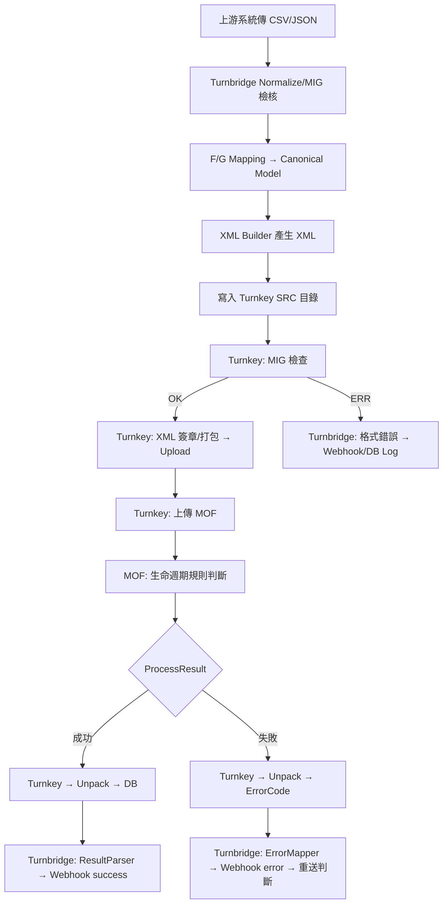

以下為 **Turnbridge 版本 — Turnkey 整體流程重寫 (`turnbridge_flow.md`)**
這份文件不是純粹的 Turnkey 說明，而是 **「以 Turnbridge 為核心」**
重新整理完整發票生命週期、Normalize 流程、Webhook 推播、Turnkey 交互等所有邏輯。

**這份文件＝你專案的正式規格文件之一**，
可直接放入：

```
docs/turnkey/turnbridge_flow.md
```

---

# Turnbridge × Turnkey — 整體運作流程（正式版）

> 目的：將「傳統 Turnkey 流程」重新定義成 Turnbridge 架構下的完整資料流、
> 包含上游 CSV、Normalize、F/G Mapping、XML 產生、Turnkey 上傳、
> ProcessResult、Webhook 推播、重送等功能。

---

# 0. 角色定義

| 角色                        | 說明                                        |
| ------------------------- | ----------------------------------------- |
| **Client（企業端）**           | 提供 CSV（舊制 A/B/C/D 格式）或 JSON（新制）           |
| **Turnbridge（你正在開發的主系統）** | Normalize、Mapping、XML 產生、Webhook 推播、管理 UI |
| **Turnkey**               | MIG 格式檢查、簽章、打包、上傳、下載 ProcessResult        |
| **MOF（財政部電子發票整合平台）**      | 收發票、做生命週期判斷、回傳 ProcessResult              |

---

# 1. Turnbridge 整體架構（企業端應導入的主流程）

以下為 Turnbridge 的完整架構圖：

```
   上游 CSV / API
         ↓
┌────────────────────┐
│     Turnbridge      │
│  - Import API       │
│  - Normalize Engine │
│  - F/G Mapping      │
│  - XML Builder      │
│  - DB (Audit/Log)   │
│  - Webhook Delivery │
└────────────────────┘
         ↓ XML
┌────────────────────┐
│       Turnkey       │
│  - MIG 檢查         │
│  - XML 簽章         │
│  - zip 打包         │
│  - 上傳 MOF         │
│  - Download Result  │
└────────────────────┘
         ↓ ProcessResult
┌────────────────────┐
│     Turnbridge      │
│  - Result Parser    │
│  - Error Mapper     │
│  - Retry Logic      │
│  - Webhook 推播     │
└────────────────────┘
         ↓
       Client
```

Turnbridge＝控制中心
Turnkey＝傳輸助手

---

# 2. 上游輸入（Client → Turnbridge）

Turnbridge 提供：

* `POST /upload/invoice` 接收 CSV 或 JSON
* 每一筆資料都須帶：

  * `legacyType`（如 C0401/C0501）
  * `rawLine`（原始 CSV）
  * 其他欄位由 Turnbridge Normalize

你已經有初版 CSV 規格：

```
C0401|InvoiceNo|InvoiceDate|InvoiceTime|SellerId|SellerName|BuyerId|BuyerName ...
```

Turnbridge 會：

1. 檢查欄位長度
2. 稅額計算是否正確
3. 字軌／發票號碼合法
4. 載具格式是否合法
5. **最多 999 明細（不可拆單）**

---

# 3. Normalize（Turnbridge 內部處理）

Normalize 輸出 **F/G Series Canonical Model（新制標準格式）**，包含：

* F0401：開立
* F0501：作廢
* F0701：註銷
* G0401：折讓開立
* G0501：折讓作廢

Normalize 結果需存入 DB：

```
import_file
import_file_log
normalized_invoice
normalized_items[]
```

---

# 4. F/G Mapping（舊制 → 新制）

Turnbridge 依照你已建立的：

```
docs/turnkey/AGENTS_MAPPING_v1.md
```

進行轉換：

| 舊制            | 新制    |
| ------------- | ----- |
| A0401、C0401 → | F0401 |
| A0501、C0501 → | F0501 |
| C0701 →       | F0701 |
| B0401、D0401 → | G0401 |
| B0501、D0501 → | G0501 |

Mapping 需：

* 保留 `legacyType`
* 保留 `rawLine`
* 所有新制欄位都必須符合 MIG 4.1

---

# 5. XML Builder（Turnbridge 負責）

Turnkey **不會幫你產生 XML**，Turnbridge 需自行完成整個匯出鏈。

匯出服務：`TurnkeyXmlExportService`

1. 依 `InvoiceStatus = NORMALIZED` 取出待處理資料（批次大小 `turnbridge.turnkey.export-batch-size`，預設 200）。
2. 呼叫 `TurnkeyXmlBuilder` 產出 F/G 新制 XML，成功後將狀態更新為 `IN_PICKUP`。
3. 透過 `ImportFileLog` 記錄 `XML_GENERATED` / `XML_GENERATE_FAILURE`，detail 包含檔名與錯誤訊息。
4. 產檔完成後寫入 `turnbridge.turnkey.inbox-dir`，若 `turnbridge.turnkey.tenant-sub-directory=true` 會在子目錄使用租戶代碼。

匯出排程：`@Scheduled(cron = ${turnbridge.turnkey.export-cron:0 */5 * * * *})`，可於 PROD 調整頻率。

營運若需立即觸發，可呼叫 `POST /api/turnkey/export?batchSize=`（需 `ROLE_ADMIN`），內部會沿用相同服務並回傳 `processed/batchSize`。

Portal 亦提供「Turnkey 匯出」頁（`/turnkey/export`，僅 ADMIN 可見），可直接輸入批次大小、檢視本次操作歷史。頁面會於進入時顯示權限提示，明確指出目前操作租戶（若為 ALL Tenant 亦會標註），若非管理者則直接阻擋並提示無權限。下方列表會顯示最近的 XML 匯出事件（`ImportFileLog` 內的 `XML_GENERATED/XML_DELIVERED_TO_TURNKEY/XML_DELIVERY_FAILURE` 等），可點擊「查看內容」彈出原始 detail（JSON 會自動排版），並提供匯入作業 / Webhook 儀表板 / Grafana 快捷入口，方便營運立即追蹤匯出後的 Turnkey 狀態。右側新增「Turnkey 拾取巡檢」卡片，透過 `GET /api/turnkey/pickup-status` 顯示 `SRC/Pack/Upload/ERR` 的滯留總數與各訊息別細項，協助營運於 Portal 即可掌握 B2SSTORAGE 是否堆積與最後巡檢時間。

檔名規則：

```
<prefix>_<MessageFamily>_<yyyyMMdd>_<invoiceId>.xml
```

其中 `<prefix>` 取自 `turnbridge.turnkey.filename-prefix`，`invoiceId` 以 6 碼補零。

XML 內容需符合 MIG 4.x XSD。若對應的發票已有相同檔名，系統會附加 timestamp 以避免覆蓋。

XML Builder 輸出目錄由 `turnbridge.turnkey.inbox-dir` 控制，  
在 DEV 測試可落到 `target/turnkey/INBOX/`，但依照《Turnkey使用說明書 v3.9》§5－6，要部署到正式環境時必須指向 Turnkey 的 **B2SSTORAGE SRC** 結構。例如：

```
EINVTurnkey/UpCast/B2SSTORAGE/<MessageType>/SRC/
```

同一路徑下可再依租戶建立子資料夾（選用）。  
XML 內容需完全符合 MIG 4.x XSD。

> 若 `turnbridge.turnkey.b2s-storage-src-base` 設定為 Turnkey 安裝目錄（如 `EINVTurnkey/UpCast/B2SSTORAGE`），系統會在產檔後自動複製至 `<base>/<MessageType>/SRC/`，成功會寫入 `XML_DELIVERED_TO_TURNKEY`，失敗則記錄 `XML_DELIVERY_FAILURE`（ImportFileLog）。

另有 `TurnkeyPickupMonitor` 依 `turnbridge.turnkey.pickup-monitor-cron` 週期巡查 `SRC/Pack/Upload/ERR` 目錄並輸出指標：

| 指標 | 說明 |
| --- | --- |
| `turnkey_pickup_src_stuck_files` | SRC 目錄滯留檔案數 |
| `turnkey_pickup_pack_stuck_files` | Pack 目錄滯留檔案數 |
| `turnkey_upload_pending_files` | Upload 目錄待上傳檔案數 |
| `turnkey_err_files` | ERR 目錄檔案數 |
| `turnkey_pickup_stage_files{stage,family}` | 依 Stage/MessageFamily 的檔案監控 |
| `turnkey_pickup_last_scan_epoch` | 最近巡檢時間（epoch second） |
| `turnkey_pickup_alert_total` | 滯留/ERR 觸發次數 |

若 `SRC` 檔案停留超過 `pickup-max-age-minutes`，會於 Log 中警告（防止 Turnkey 排程停擺）；若 `ERR` 累積檔案則記錄 Error 方便 SRE 介入。

---

# 6. Turnkey 上傳流程（Turnbridge → Turnkey）

Turnbridge 負責將 XML 丟入：

```
EINVTurnkey/UpCast/B2SSTORAGE/<MessageType>/SRC/
```
(來源：/docs/turnkey/manual/05_turnkey_runtime.md, 06_turnkey_settings.md)

Turnkey 動作：

1. MIG 檢查
2. XML 簽章
3. 產生 zip
4. 放到 Upload/
5. 上傳至 MOF
6. 下載 ProcessResult
7. 寫入 DB/Unpack

Turnkey 屬傳輸層，無業務邏輯。

---

# 7. ProcessResult（Turnkey → Turnbridge）

Turnkey 在：

```
Unpack/B2SSTORAGE/<MessageType>/ProcessResult/YYYYMMDD/HH/
```
(來源：/docs/turnkey/manual/05_turnkey_runtime.md, 08_result_codes.md)

產生：

* 成功結果（OK）
* 失敗（ERROR + ErrorCode）
* 生命週期錯誤（Status X→Y 不合法）
* 重複上傳
* 稅額不符

Turnbridge 會透過 `TurnkeyProcessResultService`：

1. 依 `turnbridge.turnkey.process-result-cron` 週期掃描 `turnbridge.turnkey.process-result-base/<MessageType>/ProcessResult/`。
2. 解析 XML → 產出 `ProcessResultPayload`（ResultCode/ErrorCode/InvoiceNumber/ErrorMessage）。
3. 透過 `TurnkeyMessage` 記錄 payload 路徑，避免重覆解析；完成後將原檔移動為 `.done`。
4. 更新 `InvoiceStatus`：`ResultCode=0` → `ACKED`，否則 `ERROR`，並寫入 `tbCode/tbCategory/tbCanAutoRetry/tbRecommendedAction/tbSourceCode/tbSourceMessage/tbResultCode`。
5. 於 `ImportFileLog` 寫入 `PROCESS_RESULT` 事件，detail 包含檔案路徑、TB Code、TurnkeyMessageId。
6. 呼叫 `WebhookDispatcher.dispatchInvoiceStatusUpdated`，依 `TurnkeyErrorMapper` 將 MOF/TK 錯誤映射為 `TB-xxxx`，Webhook payload 會攜帶 `tb_code/tb_category/can_auto_retry/recommended_action/import_id/turnkey_message_id`，並在 `webhook_delivery_log` 內進行 retry（0s → 1m → 5m → 15m）與 DLQ。
7. 指標：`turnkey_process_result_total{result=SUCCESS|ERROR}`、`turnkey_process_result_last_success_epoch` 可於 Grafana 監控解析量與最後成功時間。

---

# 8. Webhook 推播（Turnbridge）

流程：

```
ProcessResult → ResultParser → ErrorMapper → Webhook → Client
```

Webhook 設計（建議）：

## 成功：

```
POST /webhook/invoice/success
{
  "invoiceNo": "...",
  "type": "F0401",
  "status": "SUCCESS",
  "timestamp": "...",
  "platformUUID": "..."
}
```

## 失敗：

```
POST /webhook/invoice/error
{
  "invoiceNo": "...",
  "type": "F0401",
  "status": "ERROR",
  "errorCode": "3001",
  "errorMessage": "發票不存在",
  "rawLine": "...",
  "legacyType": "C0401"
}
```

Turnbridge = **唯一訊息中心**

---

# 9. 重送機制（Turnbridge）

Turnkey 不管理重送，必須由 Turnbridge 實作。

Turnbridge 負責：

* 自動重送（retry）
* 手動重送（API/UI）
* 依 ErrorCode 建議操作
* 生命週期判斷（不能亂重送）

例：

| 錯誤類型   | Turnbridge 行為        |
| ------ | -------------------- |
| 格式錯誤   | 不重送，需修正資料            |
| 生命週期錯誤 | 不重送（需改送其他訊息，如 F0501） |
| 重複上傳   | 不重送                  |
| 稅額錯誤   | 客戶修正後重送              |
| 平台異常   | 可自動重送                |

---

# 10. Turnbridge × Turnkey 全流程 Mermaid 圖



---

# 11. Turnbridge 功能總結（給架構與 PM 使用）

| 區段            | Turnbridge | Turnkey |
| ------------- | ---------- | ------- |
| CSV 解析        | ✔          | ❌       |
| Normalize     | ✔          | ❌       |
| FGMapping     | ✔          | ❌       |
| XML 產生        | ✔          | ❌       |
| MIG 檢查        | ⚠️（前置）     | ✔（官方版本） |
| XML 簽章        | ❌          | ✔       |
| 上傳            | ❌          | ✔       |
| ProcessResult | ✔（解析）      | ✔（下載）   |
| 錯誤碼 mapping   | ✔          | ❌       |
| Webhook       | ✔          | ❌       |
| 重送邏輯          | ✔          | ❌       |
| DB（業務資料）      | ✔          | ❌       |
| DB（上傳資料）      | ❌          | ✔       |

Turnbridge 是 **業務平台**
Turnkey 是 **傳輸平台工具**

兩者密不可分，但權責分工完整明確。

---
