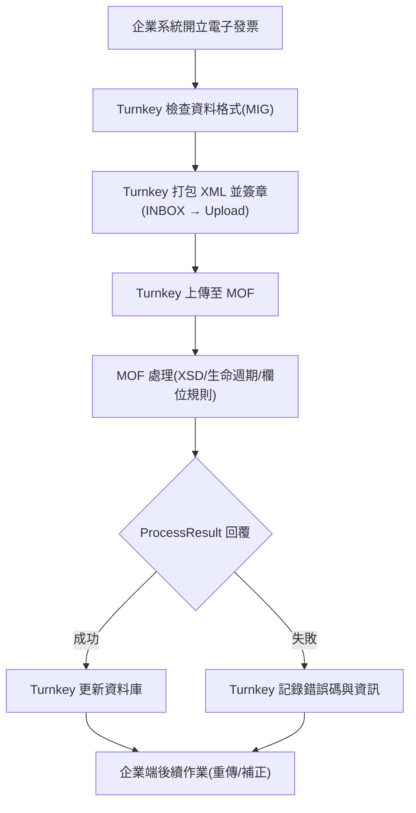

# 03 — Turnkey 整體運作流程及說明

*(Turnkey System Operation Flow)*

> 原始資料來源（Turnkey 使用說明書 v3.9.pdf）：
>
> * 【L17-L39】Turnkey 整體運作說明
> * 【L41-L55】Turnkey 流程圖對應內容
> * 【L21-L34】B2B 交換發票生命週期
> * 【L49-L59】存證發票生命週期（F/G 系列）

---

# 一、Turnkey 整體運作流程概要

Turnkey 是企業端與「電子發票整合服務平台（MOF）」之間的
**發票上傳／下載傳輸介面工具**。
其主要任務包括：

1. **驗證**企業輸入資料（MIG 格式／欄位規範）
2. **打包** XML
3. **簽章**檔案（使用 PFX 憑證）
4. **上傳**至政府平台
5. **下載** ProcessResult（平台回覆）
6. **寫入**內部資料庫
7. **回傳**結果給企業端系統
8. **協助企業處理錯誤與重傳**

整個流程可以分成 **企業端 → Turnkey → MOF → Turnkey → 企業端**
五大階段。

---

# 二、Turnkey 資料處理流程（詳細文字化流程）

以下為 PDF 原流程圖的完整文字重建：

## Step 1：企業系統產生發票資料

企業端建立電子發票資料（XML 或 CSV 格式），
包含所有開立資訊、明細、稅額計算等欄位。

---

## Step 2：Turnkey MIG 格式檢查

Turnkey 檢查項目：

* 必填欄位是否存在
* 欄位格式是否符合 MIG（日期、字串、整數、代碼長度等）
* 稅額／金額間的計算是否正確
* 載具格式是否合法（手機條碼必須以 `/` 開頭、3J0002 類別碼等）
* 字軌、發票號碼是否合法

Turnkey 端錯誤（MIG 錯誤）屬於此階段。

---

## Step 3：XML 打包與簽章（INBOX → UPLOAD）

Turnkey 會：

1. 依 MIG 規格產生 XML
2. 使用企業的軟體憑證簽章
3. 產生資料包（`.zip`）
4. 放入目錄：

```
UpCast/SRC   → 來源資料
UpCast/BAK   → 成功後備份
UpCast/ERR   → 格式錯誤
Pack/        → 打包 XML 後的封裝文件
Upload/      → 上傳前待送文件
```

---

## Step 4：上傳至電子發票整合服務平台（MOF）

Turnkey 連線至 MOF（HTTPS 443 或舊制 SFTP 2222），
進行上傳。

---

## Step 5：MOF 收件與處理

MOF（電子發票整合服務平台）會：

1. 解壓縮與解簽章
2. 檢查 XML 是否符合 XSD
3. 檢查欄位（MIG 格式）
4. 檢查 **發票生命週期是否正確**
5. 產生 ProcessResult（成功或失敗）
6. 將結果檔放置於 MOF 下載伺服器目錄

---

## Step 6：Turnkey 下載 ProcessResult（ACK / ERROR）

Turnkey 排程會自動下載 `.ProcessResult` 檔案：
下載後 Turnkey 會：

1. 解壓縮／驗證簽章
2. 解析結果
3. 更新內部資料庫
4. 匯入 result log

ProcessResult 分為：

* **成功（OK）**
* **失敗（ERROR）**
* **警告（WARNING）**

---

## Step 7：Turnkey 回寫資料庫

Turnkey 會更新內部資料表：

* 發票狀態（STATUS）
* 上傳結果
* ProcessResult 錯誤原因
* UUID（用來對應回企業原始資料）

---

## Step 8：企業系統後續處理

企業端需建立：

* **重傳機制**
* **錯誤處理流程（依 ProcessResult）**
* **資料補正與重開立流程**

企業端必須分辨：

| 錯誤來源                 | 代表含意            |
| -------------------- | --------------- |
| Turnkey 端錯誤          | 欄位格式錯誤，企業端資料不合法 |
| MOF ProcessResult 錯誤 | 資料邏輯錯誤、生命週期不合法  |

---

# 三、B2B 交換發票生命週期

> 來源：【Turnkey 使用說明書 v3.9.pdf†L21-L34】

B2B 發票生命週期具有嚴格限制：

```
① → ② → ③ → ④ → ⑤ → ⑥
```

* ①、③、⑤：未確認狀態
* ②、④、⑥：已確認狀態

### ※ 不可逆的生命週期規則

* **不可 ② → ④（但可 ③ → ④）**
* **不可 ④ → ⑥**
* **不可 ⑤ → ②**
* **不可 ③ → ⑤（避免作廢衝突）**

作廢規則：

* 賣方端需在狀態 ③ 作廢
* 買方端需在狀態 ⑤ 作廢
* 作廢只需單方確認

---

# 四、存證發票生命週期（F/G 系列）

> 來源：【Turnkey 使用說明書 v3.9.pdf†L49-L59】

存證發票（F0401/F0501/F0701）在 MIG 4.1 的生命週期為：

```
②（開立）
   ↓
④（賣方作廢）
   ↓
⑥（買方作廢 – 僅 B2B 適用）
   ↓
⑦（註銷）
```

### 特性

* 狀態必須遞增
* ②、④、⑥ 皆可直接 → ⑦
* 進入 ⑦ 後可再次返回 ②/④/⑥，但仍須保持遞增順序

---

# 五、Mermaid 流程圖（依 PDF 重建）

以下流程圖為 PDF 內流程的完整等價版本：



---

# 六、整體流程摘要（可放操作指南）

1. Turnkey 是資料傳輸工具，不是開立系統
2. Turnkey 會檢查 MIG 格式
3. Turnkey 打包並簽章後上傳
4. 平台回覆 ProcessResult
5. Turnkey 更新資料庫
6. 企業端需處理錯誤＋重傳
7. MIG 4.1 的 F/G 發票使用 B2S 目錄
8. 生命週期錯誤屬於 ProcessResult 類型

---