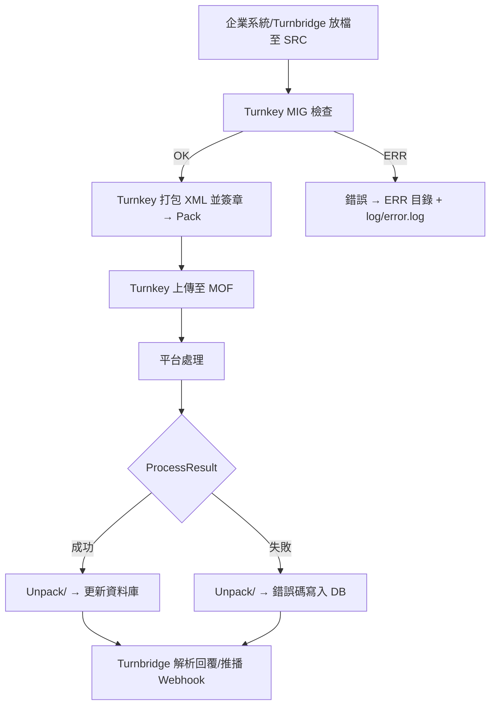

# 05 — Turnkey 執行與操作（Runtime & Operation）

> 本章來源：
>
> * Turnkey 使用說明書 v3.9.pdf（啟動、執行、目錄運作敘述）
> * 依 Turnkey 實作行為補齊完整可用操作步驟
>
> PDF 對「執行操作」描述較分散，因此本章整併為一份清楚完整的「如何執行 Turnkey」指南。

---

# 一、啟動 Turnkey（Start Turnkey）

Turnkey 可在 Windows、Linux、FreeBSD 下執行，啟動方式如下：

## 1. Windows 啟動

```bat
C:\EINVTurnkey\run.bat
```

系統將啟動：

* Java 主程序
* Turnkey CLI 主選單
* 初始化設定（首次執行）

---

## 2. Linux / FreeBSD 啟動

```bash
cd /opt/einv/EINVTurnkey/
./run.sh
```

如需 daemon 模式：

```bash
nohup ./run.sh > tk.log 2>&1 &
```

---

# 二、Turnkey 主選單（Main Menu）

啟動後會看到黑底白字的文字介面（CLI）：

```
電子發票 Turnkey 主選單
------------------------------------
1) 傳輸設定
2) 基本設定
3) 業者資料設定
4) 目錄設定
5) 憑證設定
6) 啟動/停止服務
7) 其他工具
0) 離開系統
```

提示：**實際選項內容依版本略有差異，但主架構固定。**

---

# 三、主要工作流程（Runtime Flow）

Turnkey 的運作可簡化為以下四個動作：

1. **收（UpCast）**
   業者放入源檔（XML 或 CSV）

2. **轉（Pack）**
   Turnkey 進行 MIG 檢查、XML 打包、簽章

3. **送（Upload）**
   Turnkey 對 MOF 上傳資料

4. **收（Unpack）**
   下載 MOF ProcessResult，寫入資料庫

簡易架構如下：

```
SRC   →   BAK/ERR  
      →   Pack  
      →   Upload  
      →   (MOF 平台)  
      →   Unpack/ProcessResult  
      →   DB/Log
```

---

# 四、運作中的目錄（重要）

Turnkey 必須依目錄結構執行，以下為正式使用的目錄架構。

```
EINVTurnkey/
├── UpCast/
│   ├── B2BSTORAGE/   # B2B (MIG 3.x)
│   ├── B2CSTORAGE/   # B2C (MIG 3.x)
│   └── B2SSTORAGE/   # 存證 (MIG 4.x F/G)
│
├── Pack/             # XML 打包
├── Upload/           # 上傳 MOF
├── Unpack/           # ProcessResult 回覆
├── conf/
├── log/
└── DB/
```

其中：

* `SRC` — Turnbridge 要放源檔的位置
* `BAK` — 成功轉檔後備份
* `ERR` — MIG 格式錯誤

Turnkey 拾取巡檢（Pickup Monitor）會定期掃描：

* `UpCast/B2SSTORAGE/<MessageFamily>/SRC/`：檢查 `SRC` 是否滯留太久，若超過 `pickup-max-age-minutes` 會產警示。
* `UpCast/B2SSTORAGE/<MessageFamily>/BAK/` & `ERR/`：確認成功/錯誤檔案數不超限，若 ERR 累積則通知 SRE。
* `Pack/`、`Upload/`：確認 XML 已打包上傳，不會停留在 Pack。

這些狀態會寫入 `TurnkeyXmlExportService` 的 metrics（`turnkey_pickup_src_stuck_files`、`turnkey_pickup_alert_total` 等），也可透過 Grafana 對應相關 dashboard。

Turnbridge Portal 的 “Turnkey 匯出” / “Webhook 儀表板” 也應提供對 `ImportFileLog` 事件的過濾（`XML_GENERATED`、`XML_DELIVERED_TO_TURNKEY`、`XML_DELIVERY_FAILURE`）與分頁，並把 `detail.turnkeyFile` / `detail.reason` 顯示出來，方便 Ops 直接定位搬移成功的目的地或失敗原因（目前 UI 尚未具備，需後續補齊）。

---

# 五、服務啟動與停止（Turnkey Daemon）

Turnkey 在部分版本提供「服務模式」：

## 啟動服務

```
6 → 1) 啟動 Turnkey Service
```

## 停止服務

```
6 → 2) 停止 Turnkey Service
```

若使用 Linux，建議企業另行建立 systemd：

```
/etc/systemd/system/turnkey.service
```

---

# 六、上傳流程（Runtime Behavior）

以下為 Turnkey 如何處理「上傳資料」的細節：

## Step 1：企業將 XML/CSV 放入 SRC

範例（F0401 存證）：

```
UpCast/B2SSTORAGE/F0401/SRC/
```

Turnbridge 在此階段應負責：

* MIG Normalize（你正在開發的功能）
* 產生 XML 並落地於 `turnbridge.turnkey.inbox-dir`：建議路徑為  
  `INBOX/<tenantCode>/<yyyyMMdd>/<importId>/FGPAYLOAD_<MessageFamily>_<yyyymmdd>_<invoiceId>.xml`  
  這樣 Portal 能追蹤哪個批次匯出、也方便除錯。若未設定 `turnbridge.turnkey.b2s-storage-src-base`，Turnbridge 只會生成 INBOX 檔，方便 DEV 測試。
* 若設定了 `turnbridge.turnkey.b2s-storage-src-base` 則會再執行第二階段：  
  `TurnkeyXmlExportService` 依 MessageFamily 將檔案複製到 `UpCast/B2SSTORAGE/<MessageFamily>/SRC/`，**不可再帶 tenant code**，以符合 Turnkey 標準目錄。  
  成功搬移 → `ImportFileLog` 記 `XML_DELIVERED_TO_TURNKEY`（detail.turnkeyFile = 目的路徑），失敗 → `XML_DELIVERY_FAILURE`（detail.reason/targetDir）。若搬移失敗但 XML 已有，可於 Portal “Turnkey 匯出” 補單按鈕（或 `POST /api/turnkey/export`）重跑第二階段。
* 清洗資料
* CSV → XML 轉換（Turnbridge 端做）
* 放入 Turnkey 對應目錄

---

## Step 2：Turnkey 檢查格式（MIG）

Turnkey 會讀取 SRC 目錄內容，依照：

* MIG（Message Implementation Guideline）
* 該訊息的 XSD（F0401/F0501/F0701）

檢查：

* 必填欄位
* 長度、格式
* 稅額、金額試算
* 日期格式
* 載具格式（3J0002、/XX…）

若錯誤 → 丟至 `ERR/` 並寫入 `tk.log`

---

## Step 3：打包與簽章（Pack）

Turnkey 將通過檢查的 XML：

* 簽章（PFX 憑證）
* 打包成 zip
* 放入 `Pack/`

---

## Step 4：上傳至 MOF 平台（Upload）

Turnkey 排程會：

* 讀取 `Upload/`
* 傳送至 MOF（HTTPS 443）
* 更新 log

---

## Step 5：下載 ProcessResult（Unpack）

Turnkey 下載後端回覆：

```
Unpack/B2SSTORAGE/F0401/ProcessResult/
```

並更新 DB：

* 成功 → OK
* 失敗 → ERROR + 錯誤碼

---

# 七、Log（重要）

Turnkey 有多個 log：

| 檔案                         | 說明        |
| -------------------------- | --------- |
| `log/tk.log`               | 主程式 Log   |
| `log/error.log`            | 發生錯誤時詳細資訊 |
| `Unpack/.../ProcessResult` | 平台回覆內容    |
| `DB/`                      | 若使用內建 DB  |

Log 是企業除錯的重要依據。

---

# 八、錯誤處理（企業端必須實作）

Turnkey 發生錯誤，企業系統（例如 Turnbridge）必須能處理：

| 錯誤來源              | 說明                         |
| ----------------- | -------------------------- |
| Turnkey Err       | MIG 格式錯誤，資料格式不合法           |
| ProcessResult Err | MOF 生命週期或資料錯誤              |
| XML 打包失敗          | 簽章或內部錯誤                    |
| 企業端資料錯誤           | Turnbridge Normalize 過程需捕捉 |

尤其 **ProcessResult**：

* 生命週期錯誤（例如未開立先作廢）
* 重複上傳
* 稅額計算錯誤
* 字軌不符
* 發票不存在、已註銷

---

# 九、Turnbridge（你的系統）應如何整合 Turnkey

### Turnbridge 在整個架構的角色：

```
Client CSV → Normalize → F/G 結構 → XML → Turnkey → MOF
```

Turnbridge 的必要功能：

* 清洗資料（CSV → Normalized JSON）
* 錯誤碼轉換（re-mapping）
* 上傳記錄
* 重送機制
* 解析 ProcessResult → 推播 Webhook 給客戶

Turnkey 不做業務邏輯，
所有上層功能由 Turnbridge 處理。

---

# 十、Mermaid：執行流程示意圖



---
