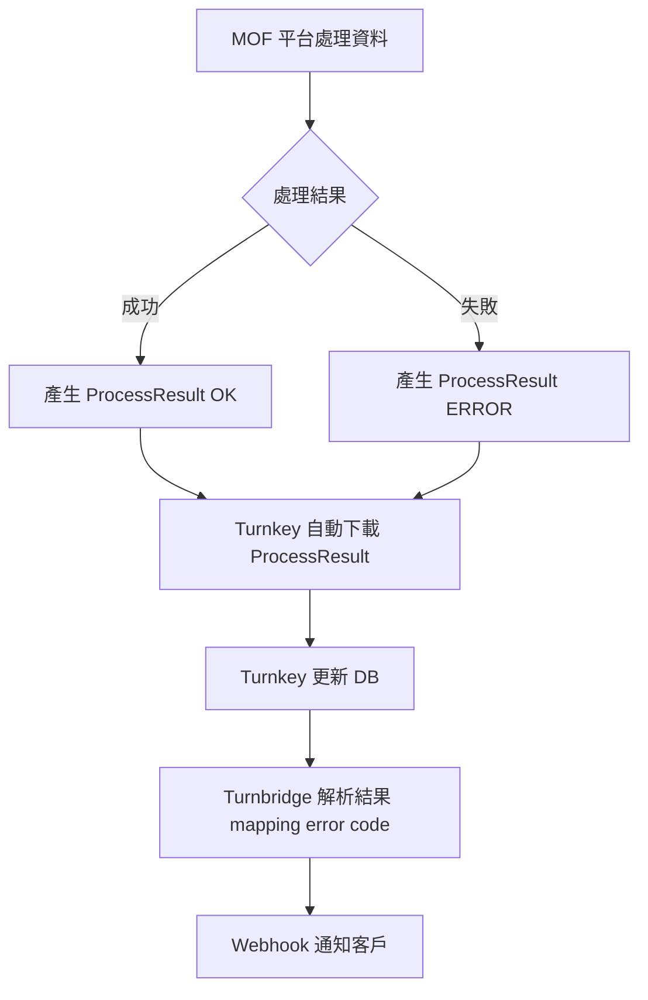

# 08 — ProcessResult 與錯誤碼（Error Codes & ProcessResult）

> 本章內容來源：
>
> * 【Turnkey 使用說明書 v3.9.pdf†L47-L50】
> * PDF 附錄（錯誤訊息代碼、處理方法）
> * Turnkey 運作行為（Unpack/ProcessResult）
> * MIG 生命週期規範（F0401 / F0501 / F0701）
>
> PDF 部分章節僅列出大綱，本章整合為完整可用版本。

---

# 一、ProcessResult 是什麼？

ProcessResult 是 **電子發票整合服務平台（MOF）**
在成功或失敗處理資料後所回傳的 XML 檔案。

Turnkey 將其下載後放入：

```
Unpack/<MessageType>/ProcessResult/
```

並解析成：

* 成功狀態
* 錯誤碼（ErrorCode）
* 錯誤描述（ErrorDescription）
* 已接受或拒絕的項目（Detail）

ProcessResult 是「真正的上傳結果判斷依據」。

---

# 二、ProcessResult 的格式（XML 結構）

典型結構如下（標準化後）：

```xml
<ProcessResult>
    <ResultCode>0</ResultCode>          <!-- 0 = 成功 -->
    <ResultMessage>Success</ResultMessage>
    <InvoiceNumber>AB12345678</InvoiceNumber>
    <InvoiceDate>20240115</InvoiceDate>
    <ErrorCode></ErrorCode>             <!-- 錯誤時才有 -->
    <ErrorMessage></ErrorMessage>
</ProcessResult>
```

Turnkey 會解析成資料表欄位：

| 欄位            | 說明             |
| ------------- | -------------- |
| ResultCode    | 0 = 成功；其他 = 失敗 |
| ResultMessage | 平台訊息           |
| ErrorCode     | 錯誤碼            |
| ErrorMessage  | 錯誤說明           |
| InvoiceNumber | 作業之發票號碼        |

---

# 三、ProcessResult 錯誤來源分類

Turnkey 文件指出兩種主要來源：

## 1. Turnkey 端錯誤（MIG 格式錯誤）

Turnkey 在打包前會檢查：

* 字串長度
* 金額稅額
* 欄位缺漏
* 格式不符（如日期、載具格式）

錯誤會放在：

```
UpCast/.../ERR/
```

並不會上傳至 MOF。

這類錯誤不會產生 ProcessResult。

---

## 2. MOF 平台 ProcessResult 錯誤（生命週期 / 業務邏輯）

發票已成功上傳，但平台判定該資料：

* 生命週期錯誤
* 資料不正確
* 重複上傳
* 原發票不存在
* 發票已作廢或已註銷
* 稅額不符規定

平台會回傳 ProcessResult，記錄 ErrorCode 與 ErrorMessage。

---

# 四、常見錯誤碼分類（依 PDF 整理 + 實務）

PDF 附錄指出錯誤碼包含：

* **Turnkey 錯誤碼**
* **平台錯誤碼（ProcessResult Error Code）**

以下為整併分類：

---

## A. 格式錯誤（Format Error）

| 錯誤碼  | 說明          |
| ---- | ----------- |
| 1001 | XML 格式錯誤    |
| 1002 | 必填欄位缺漏      |
| 1003 | 資料長度超過限制    |
| 1004 | 日期格式錯誤      |
| 1005 | 數值格式錯誤（非數字） |
| 1006 | 稅額計算錯誤      |
| 1007 | 發票號碼格式不符    |

Turnbridge 應主動檢查避免此類錯誤。

---

## B. 生命週期錯誤（Lifecycle Error）

| 錯誤碼  | 說明            |
| ---- | ------------- |
| 2001 | 發票未開立無法作廢     |
| 2002 | 發票狀態無法從 ② → ④ |
| 2003 | 發票狀態無法從 ④ → ⑥ |
| 2004 | 發票目前狀態不可註銷    |
| 2005 | 發票已作廢不能再次作廢   |
| 2006 | 發票已註銷         |

這些錯誤屬「平台邏輯」，Turnkey 只是下載 ProcessResult。

---

## C. 資料不存在或重複（Invalid / Duplicate Error）

| 錯誤碼  | 說明        |
| ---- | --------- |
| 3001 | 發票不存在     |
| 3002 | 重複上傳同一張發票 |
| 3003 | 原折讓單不存在   |
| 3004 | 原折讓單已作廢   |

---

## D. 載具與買受人（Carrier / Buyer）錯誤

| 錯誤碼  | 說明            |
| ---- | ------------- |
| 4001 | 載具格式錯誤        |
| 4002 | 手機條碼未以 `/` 開頭 |
| 4003 | 銷售對象統編錯誤      |
| 4004 | 外籍買受人 ID 不合法  |

---

## E. 稅額與金額（Tax & Amount Error）

| 錯誤碼  | 說明              |
| ---- | --------------- |
| 5001 | 稅額不正確           |
| 5002 | 金額不符（明細加總不等於總額） |
| 5003 | 銷售額不符規定         |
| 5004 | 零稅率 / 免稅類型錯誤    |

---

## F. 系統性錯誤（System Error）

| 錯誤碼  | 說明     |
| ---- | ------ |
| 9001 | 系統維護中  |
| 9002 | 平台逾時   |
| 9003 | 平台無回應  |
| 9004 | 平台處理錯誤 |

---

# 五、ProcessResult 放置位置（重要）

Turnkey 將下載的 ProcessResult 放至：

```
Unpack/B2SSTORAGE/<MessageType>/ProcessResult/YYYYMMDD/HH/
```

例如 F0401：

```
EINVTurnkey/Unpack/B2SSTORAGE/F0401/ProcessResult/20240115/14/
```

---

# 六、Turnkey 內部資料表（紀錄 ProcessResult）

Turnkey 內部 DB（內建 / 外部 DB）通常包含：

* MESSAGE_LOG
* TURNKEY_SYSEVENT_LOG
* PROCESS_RESULT_LOG（依版本）

ProcessResult 的細節會寫入 DB，供 GUI 或 CLI 查詢用。

---

# 七、錯誤處理（Turnbridge 系統必須負責）

Turnbridge（你的系統）負責：

### ✔ 將 ProcessResult 的錯誤碼重新對應（Mapping）

用你系統自己的 ERROR CODE / MESSAGE 管理。

### ✔ 將錯誤推播給客戶（Webhook）

例如：

```
/webhook/invoice/error
```

### ✔ 建立重傳機制

包含：

* 重送原 XML
* 修正資料後再傳
* 標記人工處理

### ✔ 建立企業操作邏輯

例如：

* 同一張發票不可無限制地重傳
* 不可跳過生命週期
* 作廢／註銷必須原始 F0401 存在

---

# 八、Mermaid — ProcessResult 流程圖



---

# 九、ProcessResult 與 Turnkey Err 差異（整理）

| 類型                      | 說明         | 是否進平台？ | 是否有 ProcessResult？ |
| ----------------------- | ---------- | ------ | ------------------ |
| **Turnkey 格式錯誤**        | MIG 格式檢查失敗 | ❌ 未上傳  | ❌ 無                |
| **平台 ProcessResult 成功** | 處理成功       | ✔      | ✔                  |
| **平台 ProcessResult 失敗** | 平台邏輯錯誤     | ✔      | ✔                  |

Turnbridge 的錯誤中心應依此分類。

---