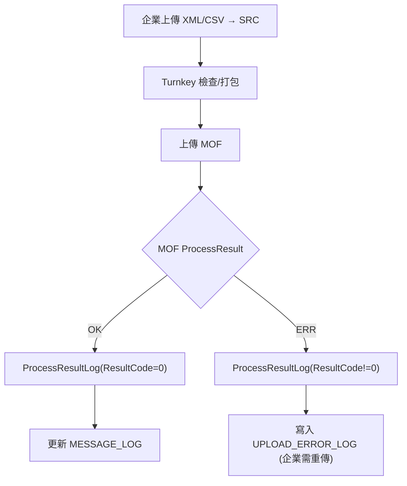

# 09 — 資料庫與備份（Database & Backup）

> 本章來源：
>
> * Turnkey 使用說明書 v3.9.pdf（資料庫設定、備份機制、內建 DB 介紹）
> * 實際 Turnkey 運作模式（DB Schema、儲存內容、備份需求）
> * MOF 官方資料庫建議
>
> PDF 對此章節描述零散，本章整合為完整可用版本。

---

# 一、Turnkey 資料庫用途（DB Purpose）

Turnkey 使用資料庫紀錄系統運作資訊，用途包含：

1. **發票/折讓上傳紀錄**
2. **ProcessResult（平台回覆）紀錄**
3. **服務運作狀態（Service Log）**
4. **錯誤記錄**
5. **檔案批次對應（Batch → File → ProcessResult）**

Turnkey 本身不儲存發票明細（Open Data），
只儲存與 **傳輸行為**相關之資訊。

---

# 二、資料庫類型（DB Type）

Turnkey v3.9 支援兩種資料庫模式：

| DB 類型                  | 說明                                  |
| ---------------------- | ----------------------------------- |
| **內建資料庫（Embedded DB）** | 安裝時自動建立，適用小型企業                      |
| **外部資料庫（External DB）** | MySQL / MSSQL / Oracle / PostgreSQL |

PDF 原文提到：

> 安裝 Turnkey 時可選擇「內建資料庫」或「設定外部資料庫」。
> 【Turnkey v3.9.pdf†L13-L42】

---

# 三、Turnkey 內建資料庫（Embedded）

內建資料庫通常為：

* **HSQLDB** 或
* **Derby**（依版本）

儲存位置：

```
EINVTurnkey/DB/
```

內建 DB 不建議用於：

* 加值中心
* 上傳量大的企業
* 需要做資料備援的場域

（Turnbridge 系統建議一律使用外部 DB。）

---

# 四、外部資料庫（External DB）

Turnkey 支援：

| DB         | 支援情況          |
| ---------- | ------------- |
| MySQL      | 常用            |
| SQL Server | 常用            |
| Oracle     | 企業常用          |
| PostgreSQL | 可運作（但不列於官方清單） |

設定方式：

```
主選單 → 2 基本設定 → 設定資料庫
```

需輸入：

* DB Host
* Port
* Database Name
* Username
* Password

Turnkey 初始化時會自動建立資料表。

---

# 五、資料表結構（DB Schema）

資料庫表結構依版本略有不同，以下為 v3.9 常見結構。

```
MESSAGE_LOG
TURNKEY_SYSEVENT_LOG
PROCESS_RESULT_LOG
UPLOAD_BATCH
UPLOAD_FILE
UPLOAD_ERROR_LOG
CERT_INFO (依版本)
```

下方逐表說明。

---

## 1. MESSAGE_LOG — 上傳紀錄

紀錄每次上傳之：

* MessageType（F0401 / F0501 / F0701）
* 檔案名稱（ZIP）
* 上傳時間
* 上傳狀態（OK / ERROR）
* UUID（與企業資料對應）
* 資料筆數

---

## 2. PROCESS_RESULT_LOG — 平台回覆紀錄

Turnkey 解析 ProcessResult 後寫入：

| 欄位           | 說明              |
| ------------ | --------------- |
| InvoiceNo    | 發票號碼            |
| ResultCode   | 0 OK / 其他 Error |
| ErrorCode    | 平台錯誤碼           |
| ErrorMessage | 詳細描述            |
| ProcessTime  | 解析時間            |
| BatchId      | 對應上傳批次          |

Turnbridge 應從此表抓回錯誤並推播 webhook。

---

## 3. UPLOAD_BATCH — 批次紀錄

紀錄企業每一批上傳內容：

* Batch No
* MessageType
* FileCount
* ProcessStatus

Turnkey 一次上傳多筆 XML，會成為一批 Batch。

---

## 4. UPLOAD_FILE — 單檔紀錄

每一批內每一個 XML（或 ZIP）都會建立一筆紀錄。

---

## 5. UPLOAD_ERROR_LOG — 上傳錯誤

紀錄 Turnkey 端錯誤（非 ProcessResult）：

* XML 格式錯誤
* MIG 欄位錯誤
* 無法簽章
* 憑證讀取錯誤
* 目錄權限不足

企業端需查看此表找出 Turnkey 端錯誤原因。

---

## 6. TURNKEY_SYSEVENT_LOG — 系統事件

含：

* 排程啟動/停止
* Log
* 配置變更
* 憑證匯入
* 連線測試結果

---

# 六、資料備份（Backup）

Turnkey 有三部分資料需要備份：

---

## A. **設定檔**

```
EINVTurnkey/conf/
```

包含：

* Turnkey.conf
* db.conf
* certificate.conf
* proxy.conf

必須每日備份。

---

## B. **資料庫（內建 DB 或外部 DB）**

### 內建 DB：

直接備份：

```
EINVTurnkey/DB/
```

若在運作中備份，建議先停止服務：

```
run.sh stop
```

### 外部 DB：

使用 DB 自己的備份機制：

* MySQL → mysqldump
* MSSQL → backup database
* Oracle → RMAN
* PostgreSQL → pg_dump

建議配置：

* 每日備份一次
* 保留至少 30 天
* 異地備援（DR site）

---

## C. **目錄（重要）**

```
UpCast/
Pack/
Upload/
Unpack/
log/
```

尤其：

* **ProcessResult**（平台回覆文件）
* **BAK**（成功備份檔）

Turnbridge 需保留 ProcessResult 以供查驗。

---

# 七、資料保留期間（Retention Policy）

依《電子發票實施作業要點》：

* 發票資料需保留 **5–7 年**（依用途不同）
* ProcessResult 必須保留以供稽查
* 上傳、錯誤 log 建議保留至少 **一年以上**

Turnbridge 建議：

```
SRC → 保留 3 個月
BAK → 保留 1 年
ERR → 保留 6 個月
Unpack → 保留 1 年
ProcessResult → 保留 5–7 年
```

---

# 八、建議監控（對 Turnbridge）

Turnbridge 應建立監控項目：

| 監控項目                 | 說明                 |
| -------------------- | ------------------ |
| DB 連線是否正常            | DB timeout / 失去連線  |
| ProcessResult 是否正常寫入 | 平台回覆是否有更新          |
| UpCast/ERR 是否大量增加    | CSV/MIG 格式有問題      |
| log/tk.log 是否持續更新    | 服務可能異常停止           |
| Disk 使用量             | 目錄塞滿會導致 Turnkey 當機 |

若 Turnbridge 要提供企業 Dashboard，可整合以上資訊。

---

# 九、Mermaid — Turnkey DB Flow



---